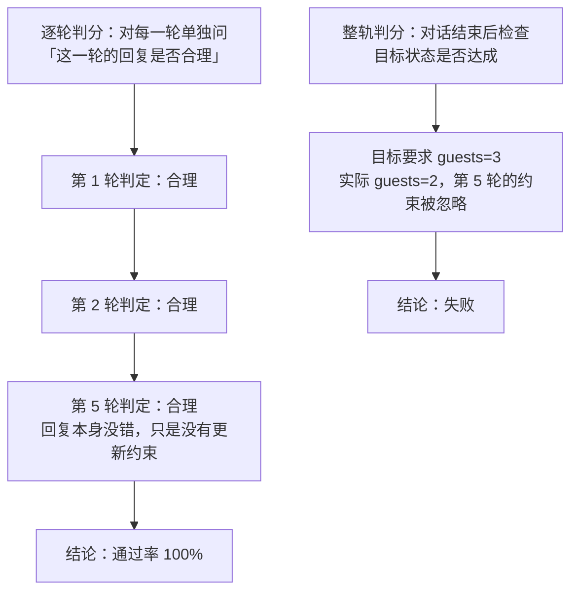

# 多轮对话为什么必须整轨判分

> **学习目标**：能够解释「多轮对话为什么必须整轨判分」的机制或步骤，并用本节材料验证理解。
>
> **前置知识**：[06-RAG作为Agent的知识获取手段](../../../../../07-agent/03-记忆与多智能体/06-RAG作为Agent的知识获取手段.md) 的检索链路、[02-评测指标设计](../../../../../07-agent/05-评测/02-评测指标设计.md) 的指标口径、[03-评测方法-单元测试与LLM即裁判](../../../../../07-agent/05-评测/03-评测方法-单元测试与LLM即裁判.md) 的 Judge 校准。
>
> **所属主题**：-RAG与多轮对话评测 · 关键机制

## 本次只学这一点

逐轮判分会系统性虚高。机制如下：

**读图要点**：

| 观察 | 含义 |
| --- | --- |
| 两种判分的输入完全相同、结论相反 | 差别只在「看单轮文本」还是「看最终状态」 |
| 逐轮判分每一格都判「合理」 | 因为每一轮回复局部自洽；错误只体现在约束的累积丢失上，单轮文本里看不出来 |
| 整轨判分绕过了自然语言 | 它直接比对数据库 / 表单 / 订单，所以能抓住「嘴上答应、动作没做」这类遗忘型失败 |
| 逐轮指标的定位是诊断 | 它能指出「从哪一轮开始跑偏」，但不能作为通过与否的依据 |
| 结论差距来自评分单位而不是评分标准 | 单轮合理性与全局目标达成之间没有蕴含关系，这是必须整轨判分的根本原因 |

逐轮判分之所以虚高，是因为**每轮的「局部合理性」不能推出全局目标达成**。更隐蔽的是「遗忘型失败」：Agent 在第 5 轮礼貌地确认「好的，已改为三人」，但最终提交的订单仍是两人——单看第 5 轮的文本完全合理。因此多轮评测必须以**最终状态**（数据库、表单、订单）为判分依据，逐轮指标只用于诊断。

配套的工程要求：**多轮评测必须固定对话历史**。改动其中任意一轮，后续所有轮次的结果都不可比；因此对话脚本要作为评测集的一部分做版本管理，不能「边跑边临时发挥」。

## 验证理解

- 合上正文，用自己的话解释本知识点解决的问题及适用边界。
- 若本节含代码、公式或流程，先预测结果，再运行、推导或逐步追踪；项目片段需要沿用原文的依赖与数据。
- 如果缺少变量、术语或完整代码，请查阅[综合原文](../../../../../07-agent/05-评测/05-RAG与多轮对话评测.md)；代码片段不等同于独立可运行项目。

## 自测与关联复习

- 「多轮对话为什么必须整轨判分」为什么需要这种设计？改变一个条件会怎样？
- 找出仍讲不清楚的地方，加入待复习并留下具体问题。
- [本主题目录](../index.md) · [完整示例、常见坑与原文自测](../../../../../07-agent/05-评测/05-RAG与多轮对话评测.md)
