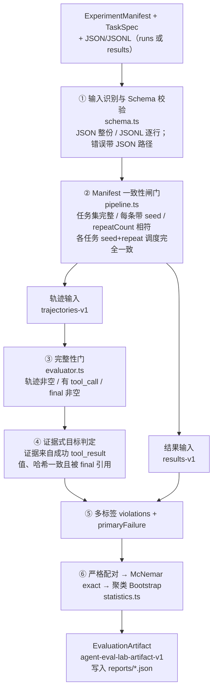

# 六段流水线

> **学习目标**：能够解释「六段流水线」的机制或步骤，并用本节材料验证理解。
>
> **前置知识**：[01-为什么Agent评测比LLM评测难](../../../../../07-agent/05-评测/01-为什么Agent评测比LLM评测难.md) 的结果层/过程层/系统层框架与四象限判定、[07-Agent工程化与可靠性设计](../../../../../07-agent/04-评估与工程化/07-Agent工程化与可靠性设计.md) 的轨迹落盘与结构化日志、基础统计学中的二项分布与 Bootstrap 重采样。
>
> **所属主题**：-项目复盘-AgentEvalLab · 架构总览

## 本次只学这一点

这张图回答一个问题：从一堆原始轨迹文件到一份可复核的报告，中间要依次通过哪几道关，每一关分别拒绝什么样的输入。

**读图要点**：

| 观察 | 含义 |
| --- | --- |
| ①② 都在评测之前 | Schema 校验管「结构合法」，一致性闸门管「跨字段业务自洽」；两者都通过，一条轨迹才有资格被判定为失败 |
| ② 之后分成两条输入路径 | 工具自己判定轨迹时走左边（③④⑤），只帮忙复算统计时走右边（直接到 ⑤） |
| ③④ 只出现在轨迹输入一侧 | 只有拿到原始轨迹才能做完整性门与证据绑定；结果输入的 `passed` 是外部已经判好的 |
| ⑤ 是两条路径的唯一汇合点 | 无论哪种输入，最终都归一成同一套 `violations` + `primaryFailure` 结构 |
| ⑥ 只做统计、不做判定 | 配对、McNemar、Bootstrap 只消费 ⑤ 的结论，所以统计口径与判定口径永远一致 |

注意 ①②的次序：**Schema 校验在一致性校验之前，一致性校验在评测之前。** 这个次序保证任何一条轨迹被判定为「失败」之前，它本身已经是结构合法的——否则你会把"数据脏"误算成"Agent 差"。

## 验证理解

- 合上正文，用自己的话解释本知识点解决的问题及适用边界。
- 若本节含代码、公式或流程，先预测结果，再运行、推导或逐步追踪；项目片段需要沿用原文的依赖与数据。
- 如果缺少变量、术语或完整代码，请查阅[综合原文](../../../../../07-agent/06-评测实战/01-项目复盘-AgentEvalLab.md)；代码片段不等同于独立可运行项目。

## 自测与关联复习

- 「六段流水线」为什么需要这种设计？改变一个条件会怎样？
- 找出仍讲不清楚的地方，加入待复习并留下具体问题。
- [本主题目录](../index.md) · [完整示例、常见坑与原文自测](../../../../../07-agent/06-评测实战/01-项目复盘-AgentEvalLab.md)
