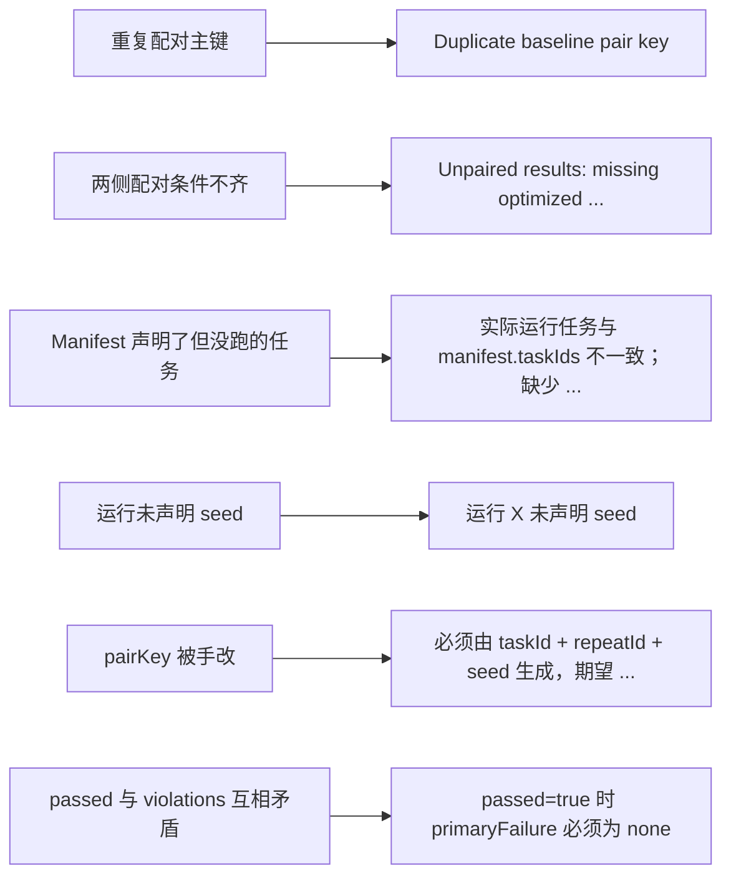

# 取舍背后的统一原则

> **学习目标**：能够解释「取舍背后的统一原则」的机制或步骤，并用本节材料验证理解。
>
> **前置知识**：[01-为什么Agent评测比LLM评测难](../../../../../07-agent/05-评测/01-为什么Agent评测比LLM评测难.md) 的结果层/过程层/系统层框架与四象限判定、[07-Agent工程化与可靠性设计](../../../../../07-agent/04-评估与工程化/07-Agent工程化与可靠性设计.md) 的轨迹落盘与结构化日志、基础统计学中的二项分布与 Bootstrap 重采样。
>
> **所属主题**：-项目复盘-AgentEvalLab · 关键设计取舍

## 本次只学这一点

把上表压成一句话：**宁可报错，也不静默。** 这个项目里几乎每一处"不友好"的行为都是刻意的：

下面这张图把「坏输入」和「抛出的错误」一一对上：每一类本该被静默处理的情况，都被换成了一个能定位到具体记录的异常。

**读图要点**：

| 观察 | 含义 |
| --- | --- |
| 左侧每类输入都对应右侧一条具体错误 | 拒绝不是笼统的「数据不合法」，而是能直接指到哪条记录、哪个字段 |
| `pairKey` 与 `passed/violations` 属于自洽性检查 | 它们不依赖外部数据，只要求同一条记录内部不矛盾，所以能在导入阶段立刻揪出伪造 |
| 所有错误都发生在评测之前 | 报告只会由通过了全部闸门的数据集产出，于是「能出报告」本身就等于「口径可信」 |
| 代价是接入时会连续撞报错 | 这是刻意做的交换：评测工具唯一的产品就是可信度 |

代价是接入时会连续撞报错，好处是**任何一个能跑出报告的数据集，其结论都是"口径可信"的**。对评测工具来说，这个交换非常划算——因为评测工具唯一的产品就是"可信度"。

## 验证理解

- 合上正文，用自己的话解释本知识点解决的问题及适用边界。
- 若本节含代码、公式或流程，先预测结果，再运行、推导或逐步追踪；项目片段需要沿用原文的依赖与数据。
- 如果缺少变量、术语或完整代码，请查阅[综合原文](../../../../../07-agent/06-评测实战/01-项目复盘-AgentEvalLab.md)；代码片段不等同于独立可运行项目。

## 自测与关联复习

- 「取舍背后的统一原则」为什么需要这种设计？改变一个条件会怎样？
- 找出仍讲不清楚的地方，加入待复习并留下具体问题。
- [本主题目录](../index.md) · [完整示例、常见坑与原文自测](../../../../../07-agent/06-评测实战/01-项目复盘-AgentEvalLab.md)
