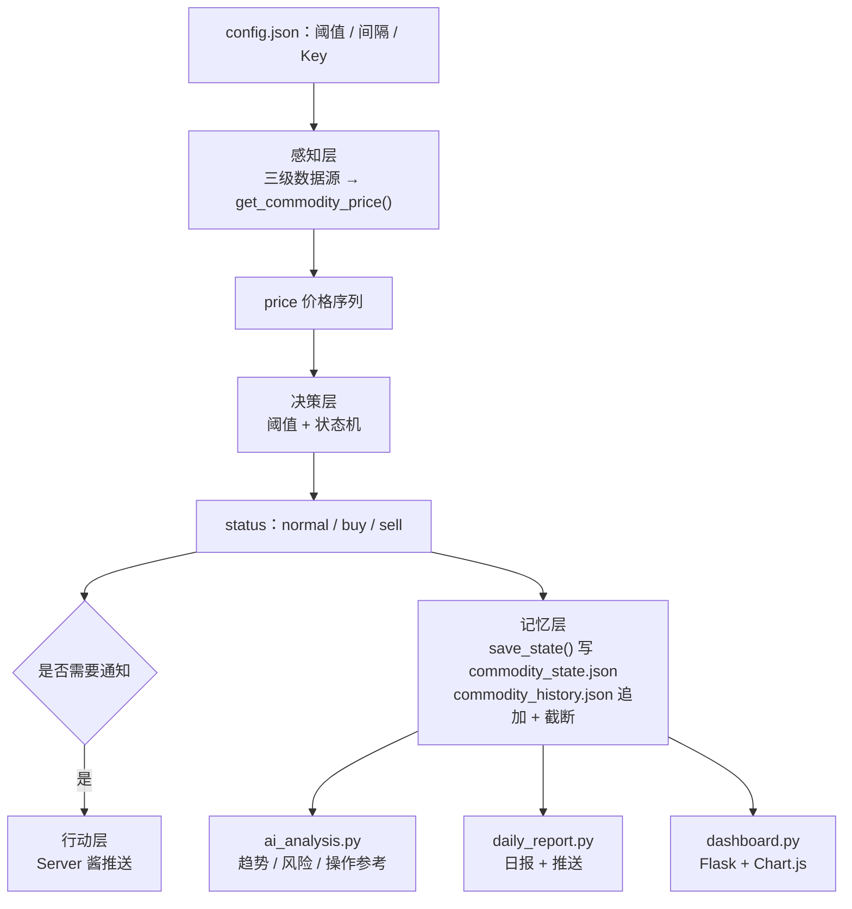

# 数据流全景

> **学习目标**：能够解释「数据流全景」的机制或步骤，并用本节材料验证理解。
>
> **前置知识**：[01-Agent基础范式与ReAct循环](../../../../../07-agent/01-基础范式/01-Agent基础范式与ReAct循环.md) 的五要素、[05-Agent的记忆与知识管理](../../../../../07-agent/03-记忆与多智能体/05-Agent的记忆与知识管理.md) 的状态与历史分离、[07-Agent工程化与可靠性设计](../../../../../07-agent/04-评估与工程化/07-Agent工程化与可靠性设计.md) 的降级与限流。
>
> **所属主题**：-大宗商品价格监控Agent项目复盘 · 关键机制

## 本次只学这一点

这张图回答：一份配置进来之后，数据在「感知 → 决策 → 记忆 / 行动」四层之间怎么流动，最后被哪几个消费者读走。

**读图要点**：

| 观察 | 含义 |
| --- | --- |
| `config.json` 是四层唯一的共同输入 | 阈值、轮询间隔、推送 Key 集中在一处，所以实时提醒与日报不会给出冲突的结论 |
| 状态机分出两条边 | 一条去「当下要不要推送」（行动），一条去「留下状态与历史」（记忆），两件事互不阻塞 |
| 三个下游消费者都只读记忆层 | 日报、AI 分析、看板互不依赖，任意一个挂掉都不影响实时提醒 |
| 记忆层是唯一的持久化落点 | 状态文件用于判断是否重复推送，历史文件用于趋势分析，两者职责不同 |
| 通知判断被单独画成一个判定节点 | 状态机产出 `status` 与「要不要打扰用户」是两件事，后者还要看阈值与静默期 |

## 验证理解

- 合上正文，用自己的话解释本知识点解决的问题及适用边界。
- 若本节含代码、公式或流程，先预测结果，再运行、推导或逐步追踪；项目片段需要沿用原文的依赖与数据。
- 如果缺少变量、术语或完整代码，请查阅[综合原文](../../../../../07-agent/07-前沿与面试/08-大宗商品价格监控Agent项目复盘.md)；代码片段不等同于独立可运行项目。

## 自测与关联复习

- 「数据流全景」为什么需要这种设计？改变一个条件会怎样？
- 找出仍讲不清楚的地方，加入待复习并留下具体问题。
- [本主题目录](../index.md) · [完整示例、常见坑与原文自测](../../../../../07-agent/07-前沿与面试/08-大宗商品价格监控Agent项目复盘.md)
