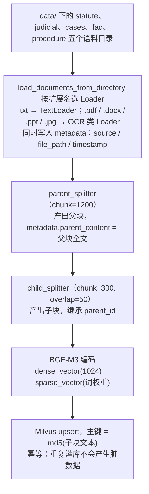

# 离线索引管线

> **学习目标**：能够解释「离线索引管线」的机制或步骤，并用本节材料验证理解。
>
> **前置知识**：Python 工程化基础、向量检索原理（Embedding / 余弦相似度 / ANN）、LangChain 的 Document 与 TextSplitter 抽象、FastAPI 基础、MySQL 与 Redis 基本操作。
>
> **所属主题**：项目实战笔记 01：法律咨询 RAG 问答系统 · 技术架构

## 本次只学这一点

这张图回答的是"一份文档从磁盘到 Milvus，中途被加工成了什么"，它只在建库时跑一次：

**读图要点**：

| 观察 | 含义 |
| --- | --- |
| 切分被做了两次：先父后子 | 一次灌库同时产出"检索用的子块"和"生成用的父块"，这是分层切分的数据基础 |
| 子块继承 `parent_id`，父块全文冗余进元数据 | 检索命中子块后**不必二次查库**就能拿到完整父块上下文 |
| 主键取 `md5(子块文本)` | 内容相同即主键相同，`upsert` 天然幂等，调试期反复重灌不会产生脏数据 |
| 一次编码同时给出 dense 与 sparse | BGE-M3 一次推理产出两种向量，省掉一整套独立的稀疏编码服务 |

## 验证理解

- 合上正文，用自己的话解释本知识点解决的问题及适用边界。
- 若本节含代码、公式或流程，先预测结果，再运行、推导或逐步追踪；项目片段需要沿用原文的依赖与数据。
- 如果缺少变量、术语或完整代码，请查阅[综合原文](../../../../../08-project/01-问答与RAG系统/01-项目-法律咨询RAG问答系统.md)；代码片段不等同于独立可运行项目。

## 自测与关联复习

- 「离线索引管线」为什么需要这种设计？改变一个条件会怎样？
- 找出仍讲不清楚的地方，加入待复习并留下具体问题。
- [本主题目录](../index.md) · [完整示例、常见坑与原文自测](../../../../../08-project/01-问答与RAG系统/01-项目-法律咨询RAG问答系统.md)
