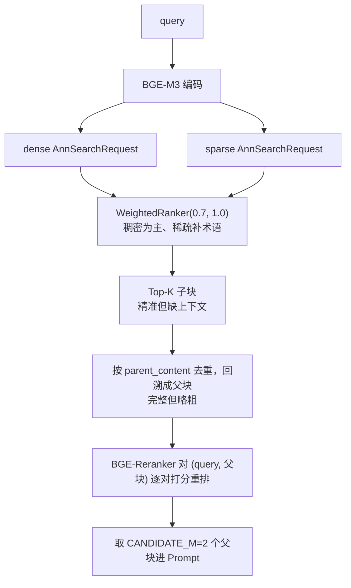

# 检索时的"小块检索、大块喂给 LLM"

> **学习目标**：能够解释「检索时的"小块检索、大块喂给 LLM"」的机制或步骤，并用本节材料验证理解。
>
> **前置知识**：Python 工程化基础、向量检索原理（Embedding / 余弦相似度 / ANN）、LangChain 的 Document 与 TextSplitter 抽象、FastAPI 基础、MySQL 与 Redis 基本操作。
>
> **所属主题**：项目实战笔记 01：法律咨询 RAG 问答系统 · 技术架构

## 本次只学这一点

这一节回答的是"一次查询从进来到变成 Prompt，中间要过几道手"：

**读图要点**：

| 观察 | 含义 |
| --- | --- |
| 一次查询走两条召回，再在 `RANK` 汇合 | 稠密管语义、稀疏管术语编号，任何一方单独用都会漏 |
| 召回单位是子块，送进 Prompt 的是父块 | "小块保精度、大块保上下文"就体现在这一步的转换上 |
| 去重发生在重排之前 | 精排成本 = 候选数 × 前向一次，先降候选再精排是通用的省钱原则 |
| 最终只留 2 个父块 | 精排的收益集中在头部，再多取只是白烧 token |

## 验证理解

- 合上正文，用自己的话解释本知识点解决的问题及适用边界。
- 若本节含代码、公式或流程，先预测结果，再运行、推导或逐步追踪；项目片段需要沿用原文的依赖与数据。
- 如果缺少变量、术语或完整代码，请查阅[综合原文](../../../../../08-project/01-问答与RAG系统/01-项目-法律咨询RAG问答系统.md)；代码片段不等同于独立可运行项目。

## 自测与关联复习

- 「检索时的"小块检索、大块喂给 LLM"」为什么需要这种设计？改变一个条件会怎样？
- 找出仍讲不清楚的地方，加入待复习并留下具体问题。
- [本主题目录](../index.md) · [完整示例、常见坑与原文自测](../../../../../08-project/01-问答与RAG系统/01-项目-法律咨询RAG问答系统.md)
