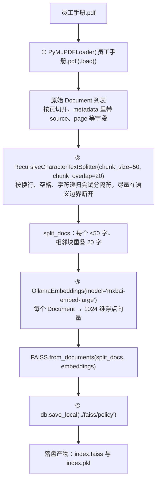

# 离线建库

> **学习目标**：能够解释「离线建库」的机制或步骤，并用本节材料验证理解。
>
> **前置知识**：Python 基础、向量检索的基本概念（Embedding / 相似度 / Top-K）、`pip` 环境管理、Streamlit 的最简用法。
>
> **所属主题**：项目实战笔记 05：企业内部制度问答助手 · 技术架构

## 本次只学这一点

这张图回答的是"一份 PDF 怎么变成可以持久化、可以检索的向量索引"：

**读图要点**：

| 观察 | 含义 |
| --- | --- |
| 四步顺序固定：加载 → 切分 → 向量化 → 存储 | RAG 的最小闭环到这里完成一半，任何一步的参数变化都会影响最终检索质量 |
| `chunk_size=50` 远小于常见经验值 | 这份 PDF 是键值对式短字段，一行就是一条完整信息，块大了会把"报销制度"和"考勤管理"混在一起 |
| 切分发生在向量化之前，且不可逆 | 块切得不好，后面换再好的模型也救不回来——这一步是效果的源头 |
| 落盘是两个文件 | `index.faiss` 存向量、`index.pkl` 存文档与映射，所以加载时两者必须成对且同源 |
| 建库只做一次，问答每次都要用 | 建库与查询必须用**同一个** embedding 模型，否则向量空间对不上 |

## 验证理解

- 合上正文，用自己的话解释本知识点解决的问题及适用边界。
- 若本节含代码、公式或流程，先预测结果，再运行、推导或逐步追踪；项目片段需要沿用原文的依赖与数据。
- 如果缺少变量、术语或完整代码，请查阅[综合原文](../../../../../08-project/01-问答与RAG系统/05-项目-企业内部制度问答助手.md)；代码片段不等同于独立可运行项目。

## 自测与关联复习

- 「离线建库」为什么需要这种设计？改变一个条件会怎样？
- 找出仍讲不清楚的地方，加入待复习并留下具体问题。
- [本主题目录](../index.md) · [完整示例、常见坑与原文自测](../../../../../08-project/01-问答与RAG系统/05-项目-企业内部制度问答助手.md)
