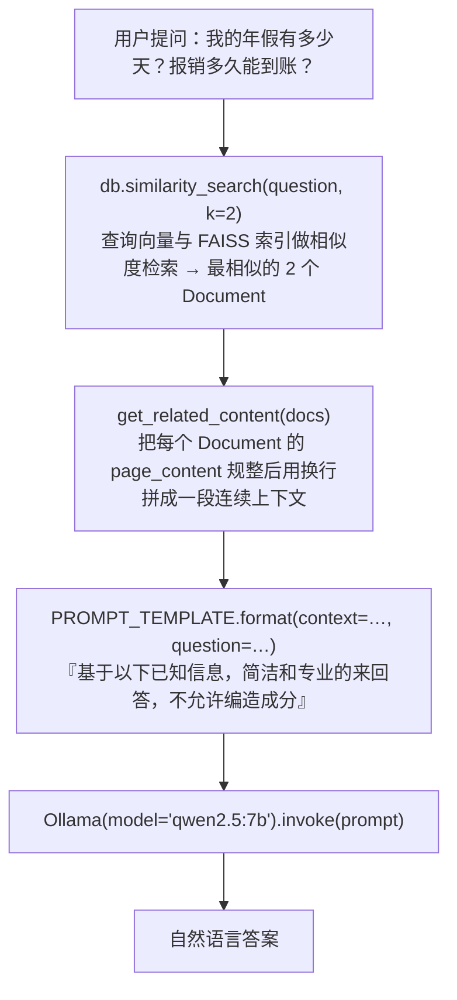

# 在线问答

> **学习目标**：能够解释「在线问答」的机制或步骤，并用本节材料验证理解。
>
> **前置知识**：Python 基础、向量检索的基本概念（Embedding / 相似度 / Top-K）、`pip` 环境管理、Streamlit 的最简用法。
>
> **所属主题**：项目实战笔记 05：企业内部制度问答助手 · 技术架构

## 本次只学这一点

这张图回答的是"一个问题从输入到答案，中间只经过哪几站"：

**读图要点**：

| 观察 | 含义 |
| --- | --- |
| 链路只有四站，没有重排、没有混合检索 | 80% 的效果来自"切分合理 + 召回准 + Prompt 约束住不编造"，其余才是工程优化 |
| `k=2` 是被问题逼出来的取值 | 提问跨越了两个语义段落，只召回 1 个块必然答不全，这也是"块小就要提高 k"的直观解释 |
| 检索与生成之间隔着一个拼装函数 | 上游是结构化 Document、下游是纯字符串，`get_related_content` 就是两者的适配层 |
| 约束"不允许编造"写在拼 Prompt 这一步 | 它是整条链路里唯一能给模型划边界的地方，缺了它 RAG 的承诺就不成立 |
| 链路里没有任何"改写"环节 | 所以省略指代式的追问会失效，这正是 2.3 节要引入 `ConversationalRetrievalChain` 的原因 |

## 验证理解

- 合上正文，用自己的话解释本知识点解决的问题及适用边界。
- 若本节含代码、公式或流程，先预测结果，再运行、推导或逐步追踪；项目片段需要沿用原文的依赖与数据。
- 如果缺少变量、术语或完整代码，请查阅[综合原文](../../../../../08-project/01-问答与RAG系统/05-项目-企业内部制度问答助手.md)；代码片段不等同于独立可运行项目。

## 自测与关联复习

- 「在线问答」为什么需要这种设计？改变一个条件会怎样？
- 找出仍讲不清楚的地方，加入待复习并留下具体问题。
- [本主题目录](../index.md) · [完整示例、常见坑与原文自测](../../../../../08-project/01-问答与RAG系统/05-项目-企业内部制度问答助手.md)
