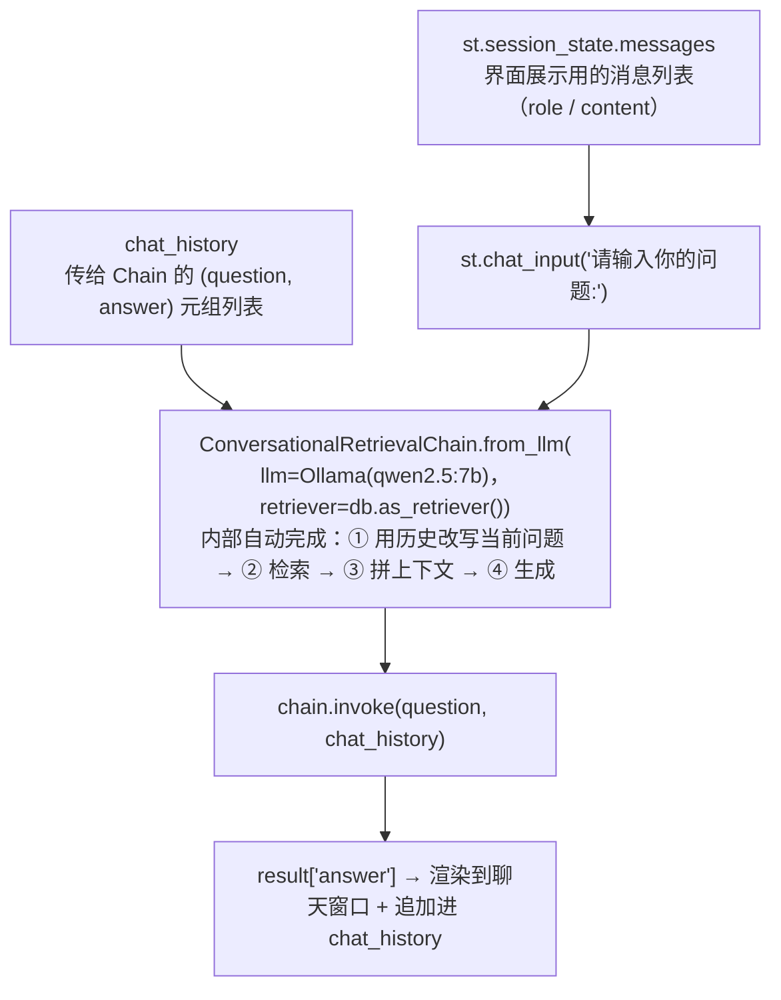

# Streamlit 多轮版本

> **学习目标**：能够解释「Streamlit 多轮版本」的机制或步骤，并用本节材料验证理解。
>
> **前置知识**：Python 基础、向量检索的基本概念（Embedding / 相似度 / Top-K）、`pip` 环境管理、Streamlit 的最简用法。
>
> **所属主题**：项目实战笔记 05：企业内部制度问答助手 · 技术架构

## 本次只学这一点

这一节回答的是"多轮对话里，界面状态和 Chain 状态是怎么各走各的"：

**读图要点**：

| 观察 | 含义 |
| --- | --- |
| 有两条历史线路并行进入 | `messages` 只服务界面回放，`chat_history` 只服务 Chain 改写，两者内容重叠但格式不同，不能合并 |
| 改写发生在 Chain 内部，对调用方透明 | 省掉手写 Query 改写的工程量，代价是每次提问多一次 LLM 调用、延迟翻倍 |
| `chat_history` 在示例里是模块级变量 | 多用户并发时会串号，正确做法是同样放进 `st.session_state` |
| 输出同时回到界面与历史 | 回答既展示又立刻成为下一轮的改写依据，这就是多轮能接上上文的原因 |

**`ConversationalRetrievalChain` 为你做了什么**：多轮对话里用户会说"那它呢？""上面那个多少钱？"，这种问题直接拿去向量检索是检索不到东西的。该链会先调用一次 LLM 把"依赖历史的省略问题"改写成"自包含的独立问题"（这一步叫 **question condensation**），再去检索。这正是 RAG 里手写"Query 改写 / HyDE / 子查询"要解决的问题——LangChain 把它内置了。

## 验证理解

- 合上正文，用自己的话解释本知识点解决的问题及适用边界。
- 若本节含代码、公式或流程，先预测结果，再运行、推导或逐步追踪；项目片段需要沿用原文的依赖与数据。
- 如果缺少变量、术语或完整代码，请查阅[综合原文](../../../../../08-project/01-问答与RAG系统/05-项目-企业内部制度问答助手.md)；代码片段不等同于独立可运行项目。

## 自测与关联复习

- 「Streamlit 多轮版本」为什么需要这种设计？改变一个条件会怎样？
- 找出仍讲不清楚的地方，加入待复习并留下具体问题。
- [本主题目录](../index.md) · [完整示例、常见坑与原文自测](../../../../../08-project/01-问答与RAG系统/05-项目-企业内部制度问答助手.md)
