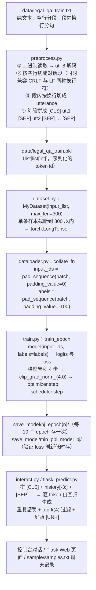

# 数据流

> **学习目标**：能够解释「数据流」的机制或步骤，并用本节材料验证理解。
>
> **前置知识**：Transformer Decoder 结构与自注意力、因果语言模型（CLM）的 shift 对齐损失、PyTorch 的 `Dataset / DataLoader / collate_fn`、HuggingFace `transformers` 的 `GPT2LMHeadModel` 与 `BertTokenizerFast`。
>
> **所属主题**：项目实战笔记 02：法律咨询问答机器人 · 技术架构

## 本次只学这一点

这张图回答的是"一份纯文本语料怎么变成能训练的批次，训完又怎么被拿去生成"：

**读图要点**：

| 观察 | 含义 |
| --- | --- |
| 管线是"文本 → pkl → 张量 → batch"四段 | 每个环节有明确的输入输出格式，出问题时能立刻定位到是哪一段的形状不对 |
| tokenize 结果被缓存成 pkl | 分词只做一次，训练时不再重复；代价是换词表必须重新生成 pkl |
| 输入 pad 用 0、标签 pad 用 -100 | 前者要喂给模型，后者要被 loss 忽略，同一个张量不能身兼两职 |
| 训练与推理在 `SAVE` 处分叉 | 保存的 checkpoint 被 `interact.py` 和 `flask_predict.py` 共用，生成逻辑只有一份 |
| 推理侧的拼接与训练侧完全同构 | `[CLS] + history[-3:] + [SEP]` 就是训练时见过的序列形状，这也是"训练与推理口径必须一致"的体现 |

## 验证理解

- 合上正文，用自己的话解释本知识点解决的问题及适用边界。
- 若本节含代码、公式或流程，先预测结果，再运行、推导或逐步追踪；项目片段需要沿用原文的依赖与数据。
- 如果缺少变量、术语或完整代码，请查阅[综合原文](../../../../../08-project/02-对话与生成系统/02-项目-法律咨询问答机器人.md)；代码片段不等同于独立可运行项目。

## 自测与关联复习

- 「数据流」为什么需要这种设计？改变一个条件会怎样？
- 找出仍讲不清楚的地方，加入待复习并留下具体问题。
- [本主题目录](../index.md) · [完整示例、常见坑与原文自测](../../../../../08-project/02-对话与生成系统/02-项目-法律咨询问答机器人.md)
