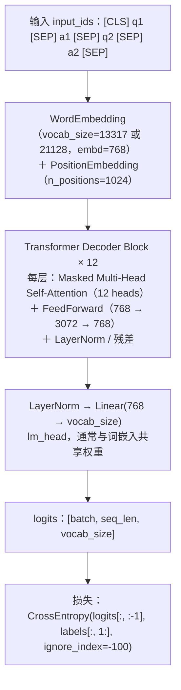

# 模型结构

> **学习目标**：能够解释「模型结构」的机制或步骤，并用本节材料验证理解。
>
> **前置知识**：Transformer Decoder 结构与自注意力、因果语言模型（CLM）的 shift 对齐损失、PyTorch 的 `Dataset / DataLoader / collate_fn`、HuggingFace `transformers` 的 `GPT2LMHeadModel` 与 `BertTokenizerFast`。
>
> **所属主题**：项目实战笔记 02：法律咨询问答机器人 · 技术架构

## 本次只学这一点

这张图回答的是"一条 token 序列从输入到 loss，中间经过了什么"：

**读图要点**：

| 观察 | 含义 |
| --- | --- |
| 输入是一条**扁平序列**，问答对用 `[SEP]` 隔开 | 没有 role 字段、没有额外 token，所以后续的拼接与解码都只需要一行代码 |
| 词嵌入与位置嵌入相加后再进解码器 | 12 层都在同一个序列上做因果注意力，所以模型"看得到"前面的所有话轮 |
| Attention 带 Masked 前缀 | 每个位置只能看到左侧，这正是自回归生成能成立的前提 |
| 出口是 `lm_head` 给出的整词表分布 | 生成时取最后一个位置的分布采样，和训练时的输出形状是同一个 |
| 损失在最后一步才做 shift 对齐 | `logits[:, :-1]` 对 `labels[:, 1:]`，位置 i 的输出预测位置 i+1 的 token |

## 验证理解

- 合上正文，用自己的话解释本知识点解决的问题及适用边界。
- 若本节含代码、公式或流程，先预测结果，再运行、推导或逐步追踪；项目片段需要沿用原文的依赖与数据。
- 如果缺少变量、术语或完整代码，请查阅[综合原文](../../../../../08-project/02-对话与生成系统/02-项目-法律咨询问答机器人.md)；代码片段不等同于独立可运行项目。

## 自测与关联复习

- 「模型结构」为什么需要这种设计？改变一个条件会怎样？
- 找出仍讲不清楚的地方，加入待复习并留下具体问题。
- [本主题目录](../index.md) · [完整示例、常见坑与原文自测](../../../../../08-project/02-对话与生成系统/02-项目-法律咨询问答机器人.md)
