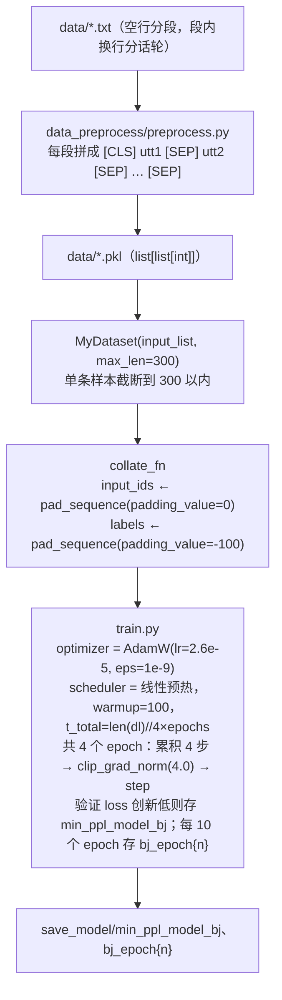

# 训练侧数据流

> **学习目标**：能够解释「训练侧数据流」的机制或步骤，并用本节材料验证理解。
>
> **前置知识**：因果语言模型与 `GPT2LMHeadModel`、多轮对话的上下文拼接、采样解码（temperature / top-k / top-p / repetition penalty）、Flask 模板渲染。
>
> **所属主题**：项目实战笔记 03：企业客服聊天机器人 · 技术架构

## 本次只学这一点

**读图要点**：

| 观察 | 含义 |
| --- | --- |
| 数据先被离线转成 pkl，训练时才读 | tokenize 只做一次，每个 epoch 不必重复分词，迭代速度取决于这一步 |
| 输入与标签从同一批数据生成两份 | `input_ids` 的 pad 用 0（要喂给模型），`labels` 的 pad 用 -100（要跳过 loss），两者职责不同不能共用一个张量 |
| `t_total` 里除以了梯度累积步数 | `scheduler.step` 只在参数真正更新时调用，写成"前向次数"会让学习率提前归零 |
| 训练结束存两份 checkpoint | 按指标最优（`min_ppl`）和按固定间隔各存一份，生成任务的自动指标与人的感受经常不一致 |

## 验证理解

- 合上正文，用自己的话解释本知识点解决的问题及适用边界。
- 若本节含代码、公式或流程，先预测结果，再运行、推导或逐步追踪；项目片段需要沿用原文的依赖与数据。
- 如果缺少变量、术语或完整代码，请查阅[综合原文](../../../../../08-project/02-对话与生成系统/03-项目-企业客服聊天机器人.md)；代码片段不等同于独立可运行项目。

## 自测与关联复习

- 「训练侧数据流」为什么需要这种设计？改变一个条件会怎样？
- 找出仍讲不清楚的地方，加入待复习并留下具体问题。
- [本主题目录](../index.md) · [完整示例、常见坑与原文自测](../../../../../08-project/02-对话与生成系统/03-项目-企业客服聊天机器人.md)
