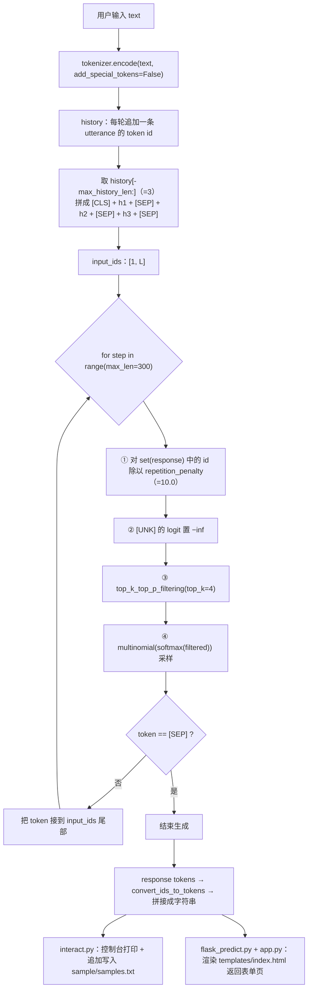

# 推理侧数据流

> **学习目标**：能够解释「推理侧数据流」的机制或步骤，并用本节材料验证理解。
>
> **前置知识**：因果语言模型与 `GPT2LMHeadModel`、多轮对话的上下文拼接、采样解码（temperature / top-k / top-p / repetition penalty）、Flask 模板渲染。
>
> **所属主题**：项目实战笔记 03：企业客服聊天机器人 · 技术架构

## 本次只学这一点

这一节回答的是"一句话怎么变成一个回答，以及回答怎么同时流向控制台和网页"：

**读图要点**：

| 观察 | 含义 |
| --- | --- |
| 生成循环里有四道过滤，顺序固定 | 先压重复、再屏蔽 `[UNK]`、然后 top-k 砍长尾、最后才采样，任何一步换顺序都会改变输出风格 |
| 采样用 `multinomial` 而不是 `argmax` | 贪心解码会稳定输出"最安全"的句子，也最容易陷入复读循环 |
| `STOP` 判据是 `[SEP]` | 同一个符号在训练时是话轮边界、推理时是结束信号，一个符号解决两个问题 |
| 历史窗口只有 3 轮 | 与 `n_ctx=1024`、`max_len=300` 的预算匹配，代价是丢失更早的长程依赖 |
| 生成结果有两个并列出口 | 交互与记录互不干扰，`samples.txt` 是后续人工评估与 bad case 沉淀的起点 |

## 验证理解

- 合上正文，用自己的话解释本知识点解决的问题及适用边界。
- 若本节含代码、公式或流程，先预测结果，再运行、推导或逐步追踪；项目片段需要沿用原文的依赖与数据。
- 如果缺少变量、术语或完整代码，请查阅[综合原文](../../../../../08-project/02-对话与生成系统/03-项目-企业客服聊天机器人.md)；代码片段不等同于独立可运行项目。

## 自测与关联复习

- 「推理侧数据流」为什么需要这种设计？改变一个条件会怎样？
- 找出仍讲不清楚的地方，加入待复习并留下具体问题。
- [本主题目录](../index.md) · [完整示例、常见坑与原文自测](../../../../../08-project/02-对话与生成系统/03-项目-企业客服聊天机器人.md)
