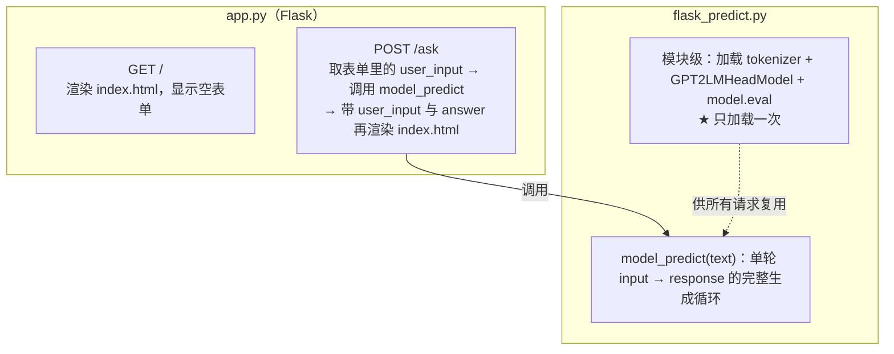

# 服务化结构

> **学习目标**：能够解释「服务化结构」的机制或步骤，并用本节材料验证理解。
>
> **前置知识**：因果语言模型与 `GPT2LMHeadModel`、多轮对话的上下文拼接、采样解码（temperature / top-k / top-p / repetition penalty）、Flask 模板渲染。
>
> **所属主题**：项目实战笔记 03：企业客服聊天机器人 · 技术架构

## 本次只学这一点

这一节回答的是"网页上的一个请求最终打在哪些代码上"：

**读图要点**：

| 观察 | 含义 |
| --- | --- |
| 两条路由一读一写，共用同一个模板 | 表单页与结果页是同一个 `index.html`，靠传入变量区分状态 |
| 模型加载在 `flask_predict.py` 的模块级，不在请求函数里 | 请求函数里加载意味着每次请求都读几百 MB 权重，响应时间会从毫秒级退化到秒级 |
| `model_predict` 每次调用都重置 `history` | 所以 Web 端实际是无状态单轮，多轮能力只在 CLI 里——这是代码写法的直接后果 |
| 服务入口与生成循环分离在两个文件 | 换框架或加并发时只动 `app.py`，生成逻辑不受影响 |
| 启动方式是 `app.run(debug=True)` | 这是单进程阻塞的开发服务器，只能用于演示，生产必须换 WSGI 服务器并关掉 `debug` |

## 验证理解

- 合上正文，用自己的话解释本知识点解决的问题及适用边界。
- 若本节含代码、公式或流程，先预测结果，再运行、推导或逐步追踪；项目片段需要沿用原文的依赖与数据。
- 如果缺少变量、术语或完整代码，请查阅[综合原文](../../../../../08-project/02-对话与生成系统/03-项目-企业客服聊天机器人.md)；代码片段不等同于独立可运行项目。

## 自测与关联复习

- 「服务化结构」为什么需要这种设计？改变一个条件会怎样？
- 找出仍讲不清楚的地方，加入待复习并留下具体问题。
- [本主题目录](../index.md) · [完整示例、常见坑与原文自测](../../../../../08-project/02-对话与生成系统/03-项目-企业客服聊天机器人.md)
