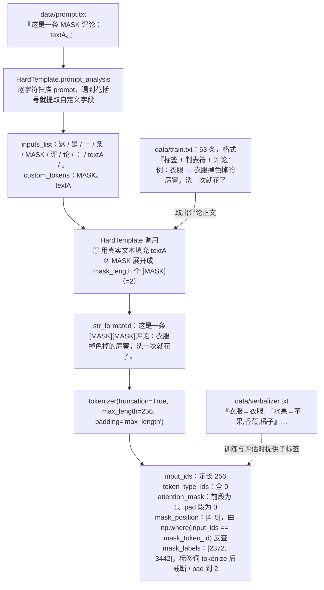

# PET 数据流（硬模板）

> **学习目标**：能够解释「PET 数据流（硬模板）」的机制或步骤，并用本节材料验证理解。
>
> **前置知识**：BERT 与 MLM（掩码语言模型）预训练目标、`[MASK]` token 的语义、`AutoModelForMaskedLM` 与 `AutoTokenizer`、HuggingFace `datasets.map(batched=True)`、PyTorch 训练循环与 `CrossEntropyLoss`。
>
> **所属主题**：项目实战笔记 06：电商评论分类（BERT+PET 与 BERT+P-Tuning） · 技术架构

## 本次只学这一点

这条链回答的是"一句人写的模板，怎么变成模型能吃进去的定长张量"：

**读图要点**：

| 观察 | 含义 |
| --- | --- |
| 模板是一个**独立文件**，先被解析成 `inputs_list` 再使用 | 模板与代码解耦，改模板不用改 Python，代价是多了"解析"这一步 |
| `prompt_analysis` 遇花括号才切出自定义字段 | 自定义字段的个数、位置都由模板决定，所以不能写死"第 5 个字符是 MASK" |
| `mask_position` 是从 `input_ids` **反查**出来的 | tokenizer 可能按字切、也可能合并英文数字，手算位置一定会偏移 |
| 出口是一个五件套的定长张量 | 序列全部 pad 到 256，所以后续 batch 拼装不需要再考虑变长 |
| `mask_labels` 在训练前还会被 Verbalizer 展开成子标签 | 这里只存了主标签的 token，真正的软目标在下一个流程里构造 |

## 验证理解

- 合上正文，用自己的话解释本知识点解决的问题及适用边界。
- 若本节含代码、公式或流程，先预测结果，再运行、推导或逐步追踪；项目片段需要沿用原文的依赖与数据。
- 如果缺少变量、术语或完整代码，请查阅[综合原文](../../../../../08-project/03-文本分类系统/06-项目-电商评论分类（BERT+PET与P-Tuning）.md)；代码片段不等同于独立可运行项目。

## 自测与关联复习

- 「PET 数据流（硬模板）」为什么需要这种设计？改变一个条件会怎样？
- 找出仍讲不清楚的地方，加入待复习并留下具体问题。
- [本主题目录](../index.md) · [完整示例、常见坑与原文自测](../../../../../08-project/03-文本分类系统/06-项目-电商评论分类（BERT+PET与P-Tuning）.md)
