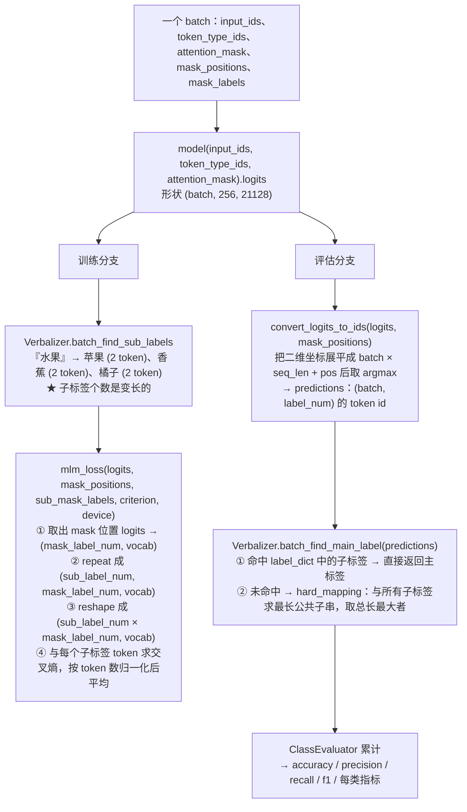

# PET 训练与评估流

> **学习目标**：能够解释「PET 训练与评估流」的机制或步骤，并用本节材料验证理解。
>
> **前置知识**：BERT 与 MLM（掩码语言模型）预训练目标、`[MASK]` token 的语义、`AutoModelForMaskedLM` 与 `AutoTokenizer`、HuggingFace `datasets.map(batched=True)`、PyTorch 训练循环与 `CrossEntropyLoss`。
>
> **所属主题**：项目实战笔记 06：电商评论分类（BERT+PET 与 BERT+P-Tuning） · 技术架构

## 本次只学这一点

这一节回答的是"同一个 `logits`，训练时和评估时分别怎么用"：

**读图要点**：

| 观察 | 含义 |
| --- | --- |
| 训练与评估共用同一个 `logits`，在 `MODEL` 之后才分叉 | 前向只有一次，区别只在"怎么解释输出"——一个算 loss，一个取 argmax |
| 训练走的是"子标签"，评估走的是"主标签" | 训练时只要命中任一子标签 loss 就低，评估时必须还原成人能看懂的类别名 |
| 子标签个数是变长的，所以 `LOSS` 里要 repeat + reshape | 一个主标签对应几个子标签，logits 就复制几份，保证"任一合法答案都算对" |
| `MAIN` 有一条模糊匹配兜底 | 模型有整个词表的自由度，输出表外词时靠最长公共子串兜住，保证永远有结果 |
| 出口是完整指标而非单一 accuracy | 10 个类、63 条样本，平均准确率几乎说明不了问题，必须看每类指标 |

## 验证理解

- 合上正文，用自己的话解释本知识点解决的问题及适用边界。
- 若本节含代码、公式或流程，先预测结果，再运行、推导或逐步追踪；项目片段需要沿用原文的依赖与数据。
- 如果缺少变量、术语或完整代码，请查阅[综合原文](../../../../../08-project/03-文本分类系统/06-项目-电商评论分类（BERT+PET与P-Tuning）.md)；代码片段不等同于独立可运行项目。

## 自测与关联复习

- 「PET 训练与评估流」为什么需要这种设计？改变一个条件会怎样？
- 找出仍讲不清楚的地方，加入待复习并留下具体问题。
- [本主题目录](../index.md) · [完整示例、常见坑与原文自测](../../../../../08-project/03-文本分类系统/06-项目-电商评论分类（BERT+PET与P-Tuning）.md)
