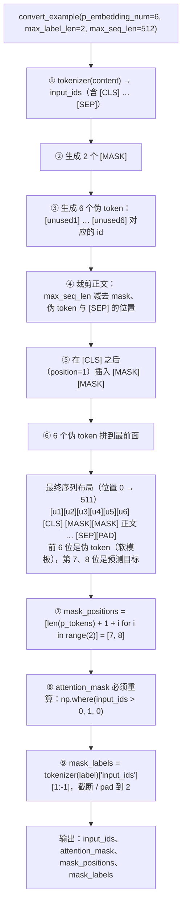

# P-Tuning 数据流（软模板）

> **学习目标**：能够解释「P-Tuning 数据流（软模板）」的机制或步骤，并用本节材料验证理解。
>
> **前置知识**：BERT 与 MLM（掩码语言模型）预训练目标、`[MASK]` token 的语义、`AutoModelForMaskedLM` 与 `AutoTokenizer`、HuggingFace `datasets.map(batched=True)`、PyTorch 训练循环与 `CrossEntropyLoss`。
>
> **所属主题**：项目实战笔记 06：电商评论分类（BERT+PET 与 BERT+P-Tuning） · 技术架构

## 本次只学这一点

软模板和硬模板的差别全在"序列是怎么拼出来的"这一步，这张图把它拆成九步：

**读图要点**：

| 观察 | 含义 |
| --- | --- |
| 伪 token 拼在最前面，`[MASK]` 插在 `[CLS]` 之后 | 位置一旦被手工改动，所有依赖位置的量都要跟着重推 |
| `④` 裁剪正文时就预留了伪 token 的位置 | 先算预算再插入，避免插完才发现超过 `max_seq_len` 把 `[SEP]` 挤掉 |
| `⑦` 的位置是**手算**的（伪 token 个数 + 1） | 与 PET 的 `np.where` 反查相反，这是本流程最脆弱的一处：伪 token 数一变就必须同步改公式 |
| `⑧` 必须重算 `attention_mask` | tokenizer 不知道自己前面被塞了 token，沿用旧 mask 会把伪 token 当 padding 忽略，软模板静默失效 |
| 出口与 PET 略有不同 | PET 多传 `token_type_ids`，P-Tuning 只关心 `input_ids` 与 mask，其余交给模型默认值 |

## 验证理解

- 合上正文，用自己的话解释本知识点解决的问题及适用边界。
- 若本节含代码、公式或流程，先预测结果，再运行、推导或逐步追踪；项目片段需要沿用原文的依赖与数据。
- 如果缺少变量、术语或完整代码，请查阅[综合原文](../../../../../08-project/03-文本分类系统/06-项目-电商评论分类（BERT+PET与P-Tuning）.md)；代码片段不等同于独立可运行项目。

## 自测与关联复习

- 「P-Tuning 数据流（软模板）」为什么需要这种设计？改变一个条件会怎样？
- 找出仍讲不清楚的地方，加入待复习并留下具体问题。
- [本主题目录](../index.md) · [完整示例、常见坑与原文自测](../../../../../08-project/03-文本分类系统/06-项目-电商评论分类（BERT+PET与P-Tuning）.md)
