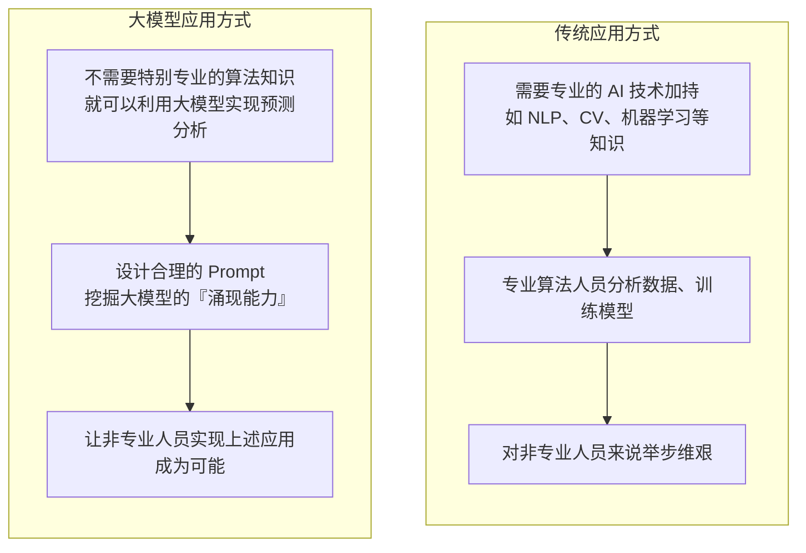

# 业务背景

> **学习目标**：能够解释「业务背景」的机制或步骤，并用本节材料验证理解。
>
> **前置知识**：In-context Learning / Zero-shot / Few-shot 的基本概念、Chat 模型的 `messages` 结构（system / user / assistant）、JSON 与正则表达式、Ollama 本地模型调用。
>
> **所属主题**：项目实战笔记 07：监管公告分类与信息抽取 · 项目目标与业务背景

## 本次只学这一点

监管领域每天产生海量文本：行政处罚决定书、行政许可决定、备案通知、行业指引、监管问答。要从这些文本里提取决策依据，传统做法需要 NLP/CV 专业算法团队去标注数据、训练模型：

**读图要点**：

| 观察 | 含义 |
| --- | --- |
| 两条链路的前两步都在做同一件事：把业务语义翻译给机器 | 差别只在"翻译"的载体——传统路线要标数据训模型，新路线要用 Prompt 描述任务 |
| 卡点位置不同 | 传统路线卡在 `T2`（必须有算法人员），新路线卡在 `L2`（Prompt 设计得好不好） |
| 终点差别是"谁能参与" | 传统路线把非专业人员挡在门外，新路线让他们能直接迭代；这正是本章的选题动机 |
| 新路线并非零门槛 | 门槛从"会训练模型"换成了"会写 Prompt、会做输出后处理"，后文的三个任务都在解决这件事 |

这个对比是本章的核心动机：**监管业务人员最懂业务语义，但不一定懂模型训练**。如果能通过设计 Prompt 让通用大模型理解"什么叫监管公告分类"，业务人员就可以自己把 AI 用起来。

## 验证理解

- 合上正文，用自己的话解释本知识点解决的问题及适用边界。
- 若本节含代码、公式或流程，先预测结果，再运行、推导或逐步追踪；项目片段需要沿用原文的依赖与数据。
- 如果缺少变量、术语或完整代码，请查阅[综合原文](../../../../../08-project/03-文本分类系统/07-项目-监管公告分类与信息抽取.md)；代码片段不等同于独立可运行项目。

## 自测与关联复习

- 「业务背景」为什么需要这种设计？改变一个条件会怎样？
- 找出仍讲不清楚的地方，加入待复习并留下具体问题。
- [本主题目录](../index.md) · [完整示例、常见坑与原文自测](../../../../../08-project/03-文本分类系统/07-项目-监管公告分类与信息抽取.md)
