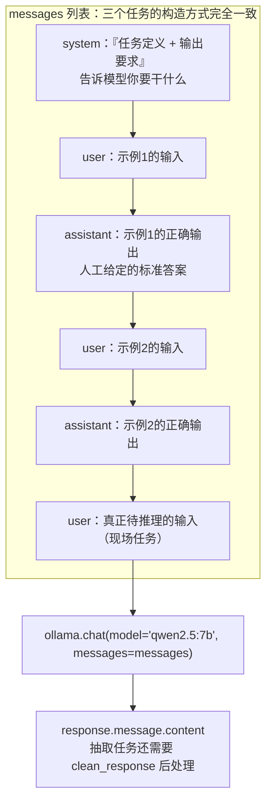

# In-context Learning 的核心结构

> **学习目标**：能够解释「In-context Learning 的核心结构」的机制或步骤，并用本节材料验证理解。
>
> **前置知识**：In-context Learning / Zero-shot / Few-shot 的基本概念、Chat 模型的 `messages` 结构（system / user / assistant）、JSON 与正则表达式、Ollama 本地模型调用。
>
> **所属主题**：项目实战笔记 07：监管公告分类与信息抽取 · 技术架构

## 本次只学这一点

三个任务的 Prompt 构造方式**完全一致**，只是内容不同。理解了这个骨架，三个任务就是填空题：

**读图要点**：

| 观察 | 含义 |
| --- | --- |
| `system` 只出现一次，位置在最前 | 它讲的是"规则"（你是谁、输出什么格式），对整段对话持续生效 |
| `user` / `assistant` 严格成对交替 | 模型是靠"续写对话"工作的，成对示例就是在演示"这道题该怎么作答" |
| 真正的任务 `Q` 与示例同构 | 待推理输入的句式必须与示例逐字一致，否则模式匹配失效——这是 Few-shot 的第一条铁律 |
| 所有示例都是**推理时**的上下文 | 不改变任何模型参数，代价是每次调用都要重传一遍示例，token 成本随示例数线性增长 |

**为什么 `assistant` 的内容要人工写**：模型在生成时是"续写这个对话"。当它看到历史上出现过多组"用户提问 → 助手规范作答"的模式，它就会模仿这个格式继续作答。**示例里 `assistant` 的部分是"用示例教格式"，`system` 的部分是"用文字讲规则"**，两者配合才能既约束内容又约束格式。

这就是 Few-shot 的本质：**不是教模型知识，而是教模型"这道题的答题格式和思路"**。

## 验证理解

- 合上正文，用自己的话解释本知识点解决的问题及适用边界。
- 若本节含代码、公式或流程，先预测结果，再运行、推导或逐步追踪；项目片段需要沿用原文的依赖与数据。
- 如果缺少变量、术语或完整代码，请查阅[综合原文](../../../../../08-project/03-文本分类系统/07-项目-监管公告分类与信息抽取.md)；代码片段不等同于独立可运行项目。

## 自测与关联复习

- 「In-context Learning 的核心结构」为什么需要这种设计？改变一个条件会怎样？
- 找出仍讲不清楚的地方，加入待复习并留下具体问题。
- [本主题目录](../index.md) · [完整示例、常见坑与原文自测](../../../../../08-project/03-文本分类系统/07-项目-监管公告分类与信息抽取.md)
