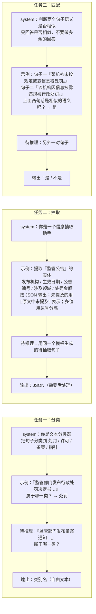

# 三个任务的 Prompt 对比

> **学习目标**：能够解释「三个任务的 Prompt 对比」的机制或步骤，并用本节材料验证理解。
>
> **前置知识**：In-context Learning / Zero-shot / Few-shot 的基本概念、Chat 模型的 `messages` 结构（system / user / assistant）、JSON 与正则表达式、Ollama 本地模型调用。
>
> **所属主题**：项目实战笔记 07：监管公告分类与信息抽取 · 技术架构

## 本次只学这一点

**读图要点**：

| 观察 | 含义 |
| --- | --- |
| 三条链的形状完全一样，只有内容不同 | 学会这一个骨架，分类 / 抽取 / 匹配就是往模板里填空 |
| `system` 里封闭集合的写法不同 | 分类要列出全部类别，抽取要列出字段 schema，匹配只有两个选项所以不列 |
| 输出格式约束的强弱不同 | 抽取最强（要 `json.loads`）、匹配次之（防啰嗦）、分类最弱（人类能读懂即可） |
| 规律：**输出越是要给程序消费，格式约束就越严** | 抽取的输出要喂给下游，所以"未提及怎么表示""多值怎么分隔"都必须写进 Prompt |
| `示例` 节点同时约束了思路与格式 | 这是 Few-shot 与 Zero-shot 的分水岭：示例教的不是知识，而是这道题的作答方式 |

**三处关键设计差异**：

| | 分类 | 抽取 | 匹配 |
| --- | --- | --- | --- |
| system 里的"类别"信息 | 必须列出所有类别 | 必须列出所有要抽的字段 + schema | 不需要，只有两个选项 |
| 输出格式约束 | 弱（只要输出类别名） | **强**（明确要求 JSON、未提及怎么表示、多值怎么分隔） | 中（"不要做多余的回答"） |
| 为什么这么设计 | 类别少、封闭，模型不容易跑偏 | 输出要喂给下游程序，格式必须可解析 | 输出空间只有 2 个值，重点是防止模型"解释一大堆" |

**规律**：**输出越是要给程序消费，格式约束就要越严。** 分类和匹配的输出人类能看懂就行，抽取的输出要 `json.loads`，所以必须把"未提及怎么表示""多值怎么分隔"都写进 Prompt——**这些细节不写，后处理就会一地鸡毛**。

## 验证理解

- 合上正文，用自己的话解释本知识点解决的问题及适用边界。
- 若本节含代码、公式或流程，先预测结果，再运行、推导或逐步追踪；项目片段需要沿用原文的依赖与数据。
- 如果缺少变量、术语或完整代码，请查阅[综合原文](../../../../../08-project/03-文本分类系统/07-项目-监管公告分类与信息抽取.md)；代码片段不等同于独立可运行项目。

## 自测与关联复习

- 「三个任务的 Prompt 对比」为什么需要这种设计？改变一个条件会怎样？
- 找出仍讲不清楚的地方，加入待复习并留下具体问题。
- [本主题目录](../index.md) · [完整示例、常见坑与原文自测](../../../../../08-project/03-文本分类系统/07-项目-监管公告分类与信息抽取.md)
