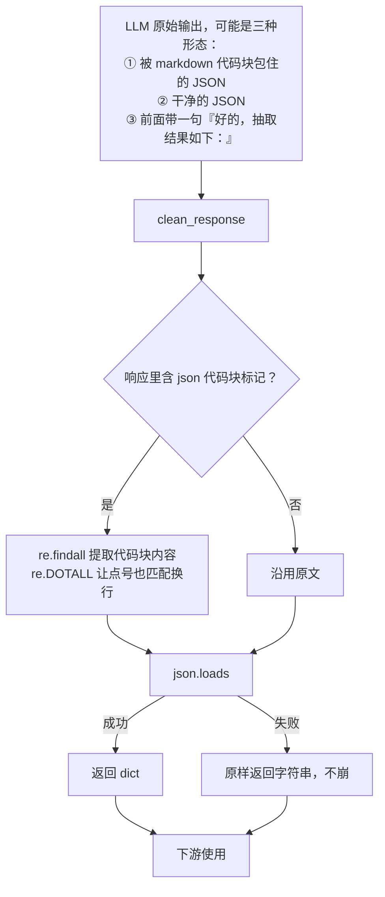

# 抽取任务的后处理流程

> **学习目标**：能够解释「抽取任务的后处理流程」的机制或步骤，并用本节材料验证理解。
>
> **前置知识**：In-context Learning / Zero-shot / Few-shot 的基本概念、Chat 模型的 `messages` 结构（system / user / assistant）、JSON 与正则表达式、Ollama 本地模型调用。
>
> **所属主题**：项目实战笔记 07：监管公告分类与信息抽取 · 技术架构

## 本次只学这一点

这一节把"模型输出"到"程序可用的 dict"之间的那一步单独画出来：

**读图要点**：

| 观察 | 含义 |
| --- | --- |
| 入口列了三种形态，说明"模型不守格式"是常态而非异常 | 后处理不是补丁，而是这条链路的标准组成部分 |
| 剥代码块标记是独立的判断分支 | 模型最爱的包装就是 markdown 代码块，`re.DOTALL` 不能省——JSON 里有换行 |
| 出口有两条：dict 或字符串 | 这是最值得警惕的一处设计：调用方拿到的东西类型不定，每次都得判类型 |
| 失败分支"不崩"是优点也是隐患 | 程序不中断，但"失败"被伪装成"另一种成功"，更干净的做法是抛异常或返回统一的错误结构 |

## 验证理解

- 合上正文，用自己的话解释本知识点解决的问题及适用边界。
- 若本节含代码、公式或流程，先预测结果，再运行、推导或逐步追踪；项目片段需要沿用原文的依赖与数据。
- 如果缺少变量、术语或完整代码，请查阅[综合原文](../../../../../08-project/03-文本分类系统/07-项目-监管公告分类与信息抽取.md)；代码片段不等同于独立可运行项目。

## 自测与关联复习

- 「抽取任务的后处理流程」为什么需要这种设计？改变一个条件会怎样？
- 找出仍讲不清楚的地方，加入待复习并留下具体问题。
- [本主题目录](../index.md) · [完整示例、常见坑与原文自测](../../../../../08-project/03-文本分类系统/07-项目-监管公告分类与信息抽取.md)
