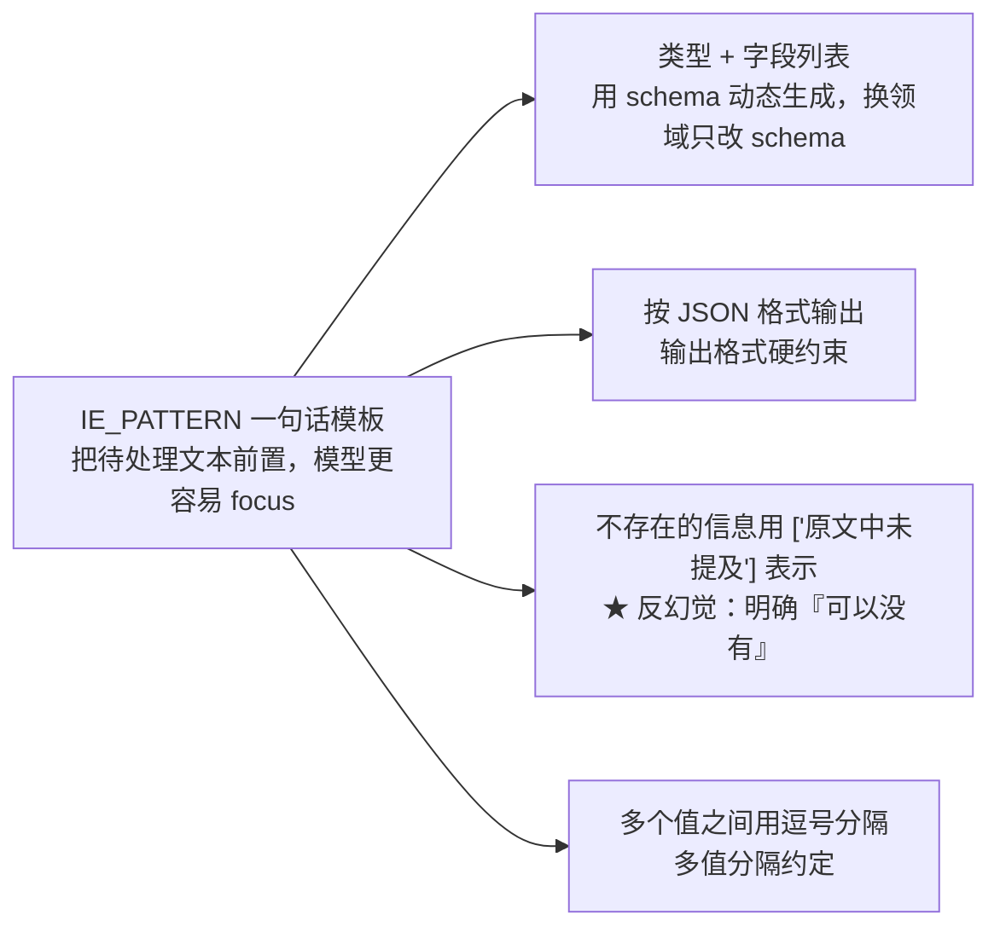

# 任务二：监管信息抽取

> **学习目标**：能够解释「任务二：监管信息抽取」的机制或步骤，并用本节材料验证理解。
>
> **前置知识**：In-context Learning / Zero-shot / Few-shot 的基本概念、Chat 模型的 `messages` 结构（system / user / assistant）、JSON 与正则表达式、Ollama 本地模型调用。
>
> **所属主题**：项目实战笔记 07：监管公告分类与信息抽取 · 核心实现

## 本次只学这一点

```text
# regulatory_ie.py
import json, re, ollama

# 定义实体 schema
schema = {'监管公告': ['发布机构', '生效日期', '公告编号', '涉及领域', '处罚金额']}

IE_PATTERN = "{}\n\n提取上述句子中{}的实体，并按照JSON格式输出，上述句子中不存在的信息用['原文中未提及']来表示，多个值之间用','分隔。"

# 提供一些例子供模型参考
ie_examples = {
 '监管公告': [
 {
 'content': '2023-01-10，某机构因业务违规被监管部门作出行政处罚。处罚决定书编号为[EOOE]监罚字〔2023〕12号，罚款金额100万元，违规行为涉及经营业务，该处罚决定自2023-02-01起生效。',
 'answers': {
 '发布机构': ['[EOOE]市监管部门'],
 '生效日期': ['2023-02-01'],
 '公告编号': ['[EOOE]监罚字〔2023〕12号'],
 '涉及领域': ['经营业务'],
 '处罚金额': ['100万元'],
 }
 }
 ]
}

def init_prompts:
 ie_pre_history = [{"role": "system", "content": "你是一个信息抽取助手。"}]

 for _type, example_list in ie_examples.items():
 for example in example_list:
 sentence = example['content']
 properties_str = ', '.join(schema[_type])
 schema_str_list = f'"{_type}"({properties_str})'
 # 输入用统一的模板生成，保证示例与真实输入格式一致
 sentence_with_prompt = IE_PATTERN.format(sentence, schema_str_list)
 ie_pre_history.append({"role": "user", "content": sentence_with_prompt})
 # 输出用 json.dumps 保证格式规范，且 ensure_ascii=False 保留中文
 ie_pre_history.append({
 "role": "assistant",
 "content": f"{json.dumps(example['answers'], ensure_ascii=False)}"
 })

 return {'ie_pre_history': ie_pre_history}
```

**`IE_PATTERN` 这一行模板是整个抽取任务的骨架**，值得逐句拆：



**读图要点**：

| 观察 | 含义 |
| --- | --- |
| 一句话里塞了四项约定 | 模板短、约束密度高，这是"Prompt 即接口定义"的典型写法 |
| 只有一项是"格式"，其余三项都是"边界约定" | 格式对了但缺失值没约定，下游照样一地鸡毛 |
| `F1` 用 schema 动态拼出来 | 换领域只改 schema 字典，模板本身不动，业务知识和流程代码因此分离 |
| `F3` 是唯一带"反幻觉"性质的一项 | 不说"可以没有"，模型面对缺失字段就会编造、省略 key 或输出 null 三种行为随机发生 |

**"用 `['原文中未提及']` 表示不存在的信息"是这条 Prompt 里最有价值的一句话。** 不写这句，模型面对"这段话里没有处罚金额"的情况会有三种可能行为：

1. 编一个数字出来（最危险）；
2. 直接省略这个 key（下游 `result['处罚金额']` 会 KeyError）；
3. 输出 `null` 或空字符串（还算可接受）。

明确告诉它"可以没有、没有时该怎么写"，就把不确定行为变成了**确定的约定**。这是提示工程里对抗幻觉最实用的手法之一：**不要只说"不要编造"，要给出"不知道时该输出什么"。** 这与 RAG 里"信息不足请联系客服"是同一个思路。

后处理：

```text
def clean_response(response: str):
 """后处理模型输出"""
 if '```json' in response:
 res = re.findall(r'```json(.*?)```', response, re.DOTALL)
 if len(res) and res[0]:
 response = res[0]
 response.replace('、', ',') # ⚠️ 见下方踩坑说明
 try:
 return json.loads(response)
 except Exception:
 return response # 解析失败就原样返回，不让程序崩
```

推理时动态构造 schema：

```python
def inference(sentences: list, custom_settings: dict):
    for sentence in sentences:
        cls_res = "监管公告"
        if cls_res not in schema:
            print(f'The type model inferenced {cls_res} which is not in schema dict, exited.')
            exit
            properties_str = ', '.join(schema[cls_res])
            schema_str_list = f'"{cls_res}"({properties_str})'
            sentence_with_ie_prompt = IE_PATTERN.format(sentence, schema_str_list)

            messages = [*custom_settings['ie_pre_history'],
            {"role": "user", "content": sentence_with_ie_prompt}]
            response = ollama.chat(model="qwen2.5:7b", messages=messages)
            ie_res = clean_response(response["message"]["content"])
            print(f'sentence: {sentence}')
            print(f'inference answer: {ie_res}')
```

**这段代码里有一个真实的 bug 值得单独说**：

```python
response.replace('、', ',') # ← 这行是无效的！
```

Python 的 `str` 是**不可变对象**，`replace` 返回新字符串而**不修改原对象**。所以这行代码什么也没做。正确写法是：

```python
response = response.replace('、', ',')
```

这个 bug 不会报错、不会崩，只是"本来想做的中文顿号替换悄悄失效了"。**这是 Python 新手最经典的一类错误**，也是为什么"代码能跑"和"代码正确"是两件事。修法很简单，但它揭示了一个更重要的教训：**任何一个不做任何事、也不报错的语句，都值得怀疑**。

## 验证理解

- 合上正文，用自己的话解释本知识点解决的问题及适用边界。
- 若本节含代码、公式或流程，先预测结果，再运行、推导或逐步追踪；项目片段需要沿用原文的依赖与数据。
- 如果缺少变量、术语或完整代码，请查阅[综合原文](../../../../../08-project/03-文本分类系统/07-项目-监管公告分类与信息抽取.md)；代码片段不等同于独立可运行项目。

## 自测与关联复习

- 「任务二：监管信息抽取」为什么需要这种设计？改变一个条件会怎样？
- 找出仍讲不清楚的地方，加入待复习并留下具体问题。
- [本主题目录](../index.md) · [完整示例、常见坑与原文自测](../../../../../08-project/03-文本分类系统/07-项目-监管公告分类与信息抽取.md)
