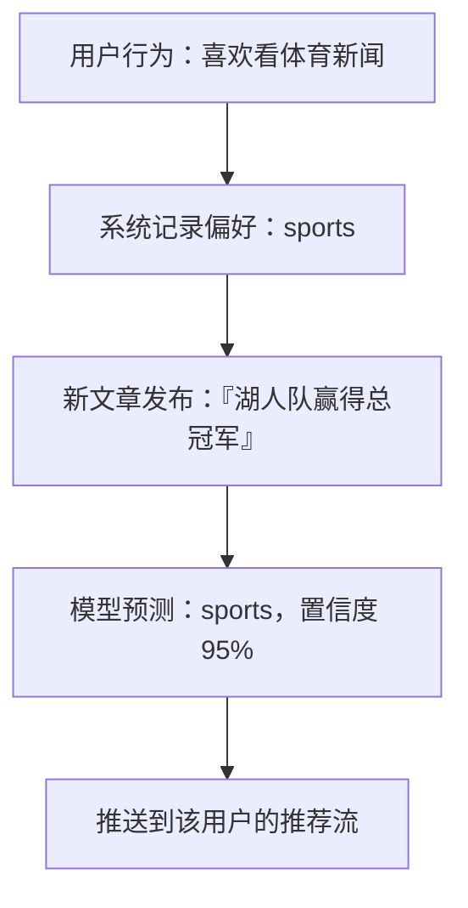

# 业务场景

> **学习目标**：能够解释「业务场景」的机制或步骤，并用本节材料验证理解。
>
> **前置知识**：TF-IDF 与词袋模型、jieba 分词、`sklearn` 的 `TfidfVectorizer` / `RandomForestClassifier`、PyTorch 训练循环、BERT 的 `[CLS]` 与 attention mask。
>
> **所属主题**：项目实战笔记 08：新闻文本分类三方案对比（随机森林 / FastText / BERT） · 项目目标与业务背景

## 本次只学这一点

新闻资讯平台每天要处理**数百万篇新闻**，分类是推荐系统的前置环节：

**读图要点**：

| 观察 | 含义 |
| --- | --- |
| 分类处在"新文章发布"与"推送到推荐流"之间 | 它是推荐链路的一环，因此延迟与吞吐和精度同等重要 |
| 判定单位是**频道**而不是文章内容 | 类别封闭且固定 10 个，任务边界清晰，这是后面三方案可比的前提 |
| 置信度 95% 是被消费的下游信号 | 低置信度样本可以路由给更重的模型或人工，这是分层推理的接口 |
| 这条链路每天要跑百万次 | 单条推理的成本差异会被放大成"1.4 小时"和"50 小时"的差别 |

这个场景的三个特点决定了后文所有选型取向：**量大**（每天百万级，必须算推理成本）、**要实时**（新文章发布后快速上线）、**类别封闭且平衡**（固定 10 个频道，每类 18000 条）。**精度重要，但吞吐和延迟同等重要。**

## 验证理解

- 合上正文，用自己的话解释本知识点解决的问题及适用边界。
- 若本节含代码、公式或流程，先预测结果，再运行、推导或逐步追踪；项目片段需要沿用原文的依赖与数据。
- 如果缺少变量、术语或完整代码，请查阅[综合原文](../../../../../08-project/03-文本分类系统/08-项目-新闻文本分类三方案对比（随机森林FastTextBERT）.md)；代码片段不等同于独立可运行项目。

## 自测与关联复习

- 「业务场景」为什么需要这种设计？改变一个条件会怎样？
- 找出仍讲不清楚的地方，加入待复习并留下具体问题。
- [本主题目录](../index.md) · [完整示例、常见坑与原文自测](../../../../../08-project/03-文本分类系统/08-项目-新闻文本分类三方案对比（随机森林FastTextBERT）.md)
