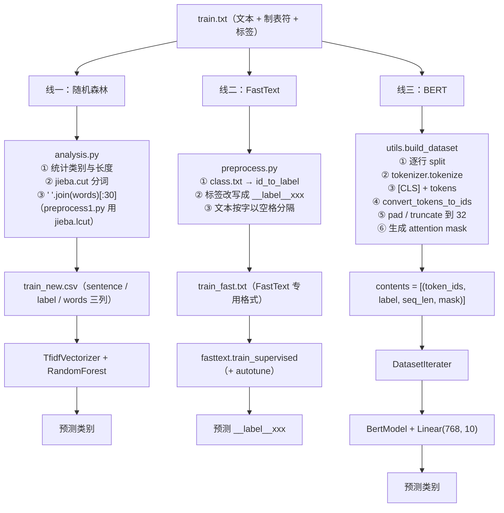

# 一份文本，三种格式

> **学习目标**：能够解释「一份文本，三种格式」的机制或步骤，并用本节材料验证理解。
>
> **前置知识**：TF-IDF 与词袋模型、jieba 分词、`sklearn` 的 `TfidfVectorizer` / `RandomForestClassifier`、PyTorch 训练循环、BERT 的 `[CLS]` 与 attention mask。
>
> **所属主题**：项目实战笔记 08：新闻文本分类三方案对比（随机森林 / FastText / BERT） · 技术架构

## 本次只学这一点

同一个 `train.txt`，三种模型需要的输入完全不同。这是本项目数据工程部分最值得学的点：

**读图要点**：

| 观察 | 含义 |
| --- | --- |
| 同一个源文件分出三条支线 | 每个模型对"什么是 token"的定义不同，所以切分口径必须分开做 |
| 线一先分词、线二按字、线三交给 WordPiece | TF-IDF 的词汇表是词；FastText 的子词机制本就为 OOV 设计；BERT 必须用它自己训好的切分器 |
| 三条支线的产物中间格式都不一样 | 分别是 csv、`__label__` 文本、`(token_ids, label, seq_len, mask)` 元组，这是"模型输入格式由它的 tokenizer 定义"的具体体现 |
| 三条支线在最后才汇到同一件事：预测类别 | 数据管线各不相同，但评价口径统一，三组准确率才可比 |
| 线二的出口带着 `__label__` 前缀 | 这是 FastText 的格式要求，也提醒接口层要做一层转换再对外返回 |

| | 随机森林 | FastText | BERT |
| --- | --- | --- | --- |
| 切分单位 | jieba 词 | 字（或 jieba 词） | BertTokenizer 的 WordPiece |
| 表示 | `"中华 女子 学院 ："` | `"__label__education 中 华 女"` | `[101, 2345, ..., 0, 0]` |
| 长度处理 | 截断到 30 字 | 不限制 | pad/truncate 到 32 |
| 特征 | TF-IDF 稀疏向量 | 词向量 + n-gram | 上下文相关表示 |

**为什么要三份数据**：每个模型对"什么是 token"的定义不同。TF-IDF 的词汇表是**词**，必须 jieba 分词；FastText 的子词机制本就为 OOV 设计，中文按字切分效果更好；BERT 有自己训好的 WordPiece，**绝不能自己分词后再喂给它**——插进去的空格会破坏预训练时的输入分布，表现是"能训、不报错、精度偏低"。

## 验证理解

- 合上正文，用自己的话解释本知识点解决的问题及适用边界。
- 若本节含代码、公式或流程，先预测结果，再运行、推导或逐步追踪；项目片段需要沿用原文的依赖与数据。
- 如果缺少变量、术语或完整代码，请查阅[综合原文](../../../../../08-project/03-文本分类系统/08-项目-新闻文本分类三方案对比（随机森林FastTextBERT）.md)；代码片段不等同于独立可运行项目。

## 自测与关联复习

- 「一份文本，三种格式」为什么需要这种设计？改变一个条件会怎样？
- 找出仍讲不清楚的地方，加入待复习并留下具体问题。
- [本主题目录](../index.md) · [完整示例、常见坑与原文自测](../../../../../08-project/03-文本分类系统/08-项目-新闻文本分类三方案对比（随机森林FastTextBERT）.md)
