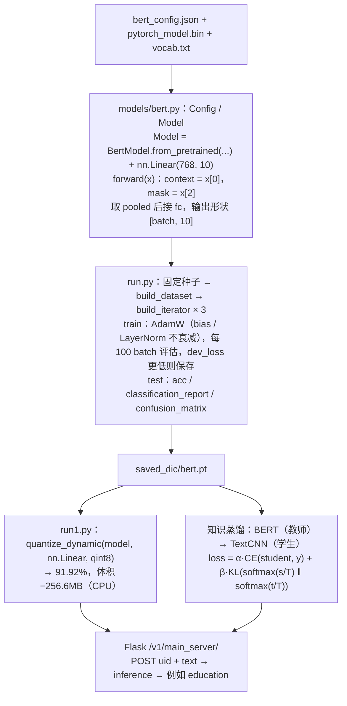

# BERT 训练与部署链路

> **学习目标**：能够解释「BERT 训练与部署链路」的机制或步骤，并用本节材料验证理解。
>
> **前置知识**：TF-IDF 与词袋模型、jieba 分词、`sklearn` 的 `TfidfVectorizer` / `RandomForestClassifier`、PyTorch 训练循环、BERT 的 `[CLS]` 与 attention mask。
>
> **所属主题**：项目实战笔记 08：新闻文本分类三方案对比（随机森林 / FastText / BERT） · 技术架构

## 本次只学这一点

这一节回答的是"一份预训练权重到最后对外提供服务，中间要过哪些环节"：

**读图要点**：

| 观察 | 含义 |
| --- | --- |
| 模型定义只有两行有效代码：`from_pretrained` + 一个 `nn.Linear` | 预训练已经把表示学好了，微调阶段新增的参数极少，所以两轮就能收敛 |
| `SAVE` 之后分成量化与蒸馏两条压缩路线 | 量化不改结构直接瘦身，蒸馏换更小的学生模型，两者可叠加 |
| 两条压缩路线汇到同一个服务入口 | 服务接口与模型实现解耦，换后端不用改调用方 |
| 训练环节特别标注了"固定种子" | 方案对比实验里，没有固定种子时"提升"可能只是随机波动 |
| 出口返回的是 `education` 而不是 `__label__education` | 与 FastText 支线对比可见：模型输出的原始格式必须在接口层转换掉 |

## 验证理解

- 合上正文，用自己的话解释本知识点解决的问题及适用边界。
- 若本节含代码、公式或流程，先预测结果，再运行、推导或逐步追踪；项目片段需要沿用原文的依赖与数据。
- 如果缺少变量、术语或完整代码，请查阅[综合原文](../../../../../08-project/03-文本分类系统/08-项目-新闻文本分类三方案对比（随机森林FastTextBERT）.md)；代码片段不等同于独立可运行项目。

## 自测与关联复习

- 「BERT 训练与部署链路」为什么需要这种设计？改变一个条件会怎样？
- 找出仍讲不清楚的地方，加入待复习并留下具体问题。
- [本主题目录](../index.md) · [完整示例、常见坑与原文自测](../../../../../08-project/03-文本分类系统/08-项目-新闻文本分类三方案对比（随机森林FastTextBERT）.md)
