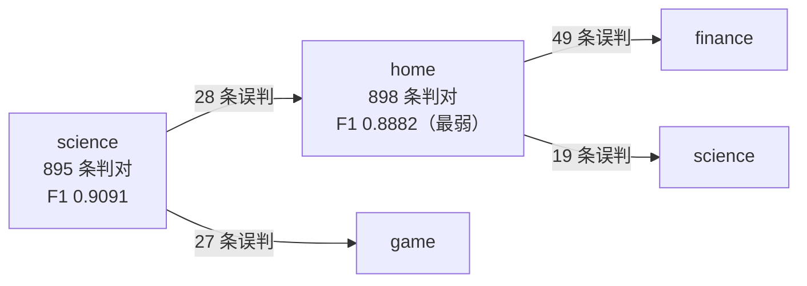

# 测试结果该怎么读

> **学习目标**：能够解释「测试结果该怎么读」的机制或步骤，并用本节材料验证理解。
>
> **前置知识**：TF-IDF 与词袋模型、jieba 分词、`sklearn` 的 `TfidfVectorizer` / `RandomForestClassifier`、PyTorch 训练循环、BERT 的 `[CLS]` 与 attention mask。
>
> **所属主题**：项目实战笔记 08：新闻文本分类三方案对比（随机森林 / FastText / BERT） · 核心实现

## 本次只学这一点

测试集上 **Test Acc: 93.64%**，`macro avg` 与 `weighted avg` 都是 0.9364。各类指标：

| 类别 | precision | recall | f1-score | 备注 |
| --- | --- | --- | --- | --- |
| home | 0.8787 | 0.8980 | 0.8882 | 最弱 |
| science | 0.9236 | 0.8950 | 0.9091 | 次弱 |
| education | 0.9511 | 0.9730 | 0.9619 | |
| sports | 0.9780 | 0.9780 | 0.9780 | 最强 |

混淆矩阵原始输出（节选，行方向是真实标签、列方向是预测标签）：

```text
 home 行 [ 49 12 898 1 19 1 15 0 2 3]
science 行 [ 4 4 28 7 895 10 12 2 27 11]
```

矩阵里最值得看的不是对角线上有多少，而是错误"流向"了谁，所以把它画成图：



**读图要点**：

| 观察 | 含义 |
| --- | --- |
| 错误**全部**流向语义相邻的频道 | home ↔ finance ↔ science、science ↔ game 本就是模糊边界，"新款智能家居产品发布"算 `home` 还是 `science` 没有标准答案 |
| 最弱类别既是错误的起点也是终点 | `home` 与 `science` 互相误判，说明不是某一类数据脏，而是两类的分界线本身不清 |
| macro 与 weighted 几乎完全相同 | 类别严格均衡，模型没有偏向多数类，此时 accuracy 是可信指标 |
| 错误集中而非分散 | 集中在少数几个相邻类别上，说明"再调参"收益有限，解法要么是合并语义重叠类别，要么是接受这个误差 |
| 三个数字要连起来看：0.9364 的 accuracy、0.8882 的最弱 F1、邻近类别的混淆 | 只看 accuracy 会漏掉"哪一类在拖后腿"，只看最弱类会漏掉"这是任务边界问题而非模型问题" |

**三步诊断法**：

**第一步：看 macro 与 weighted 是否接近。** 这里两者几乎完全一致 → **类别均衡，模型没有偏向多数类**。若 macro 明显低于 weighted，说明模型对小类别表现差、被大类别高分掩盖了。

**第二步：找最弱和最强的类别。** 最弱 `home`（0.8882）、`science`（0.9091）；最强 `sports`（0.9780）、`education`（0.9619）。

**第三步：从混淆矩阵找根因。** 非对角线上的大数字揭示了模式：**"财经/房产/家居"三者互相混淆，"科技/游戏/时尚"三者互相混淆**。这在语义上完全合理——"新款智能家居产品发布"到底是 `science` 还是 `home`？**边界本身就模糊。**

由此推导出的改进方向：合并语义重叠类别（业务上可否接受？）、引入更多区分性特征、对最弱类别做数据增强、**或者接受这个误差**。

**最后一点尤其重要**：如果人工标注一致性本身只有 92%，模型做到 93.64% 就已经**超过人类水平**，再优化就是在拟合标注噪声。**做模型评估前先搞清楚"这个任务的理论上限在哪"**，否则会陷入无意义的调优。

## 验证理解

- 合上正文，用自己的话解释本知识点解决的问题及适用边界。
- 若本节含代码、公式或流程，先预测结果，再运行、推导或逐步追踪；项目片段需要沿用原文的依赖与数据。
- 如果缺少变量、术语或完整代码，请查阅[综合原文](../../../../../08-project/03-文本分类系统/08-项目-新闻文本分类三方案对比（随机森林FastTextBERT）.md)；代码片段不等同于独立可运行项目。

## 自测与关联复习

- 「测试结果该怎么读」为什么需要这种设计？改变一个条件会怎样？
- 找出仍讲不清楚的地方，加入待复习并留下具体问题。
- [本主题目录](../index.md) · [完整示例、常见坑与原文自测](../../../../../08-project/03-文本分类系统/08-项目-新闻文本分类三方案对比（随机森林FastTextBERT）.md)
