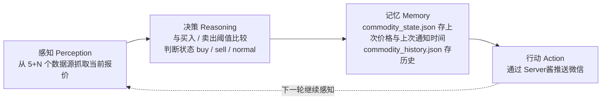

# 为什么叫它 "Agent"

> **学习目标**：能够解释「为什么叫它 "Agent"」的机制或步骤，并用本节材料验证理解。
>
> **前置知识**：Python `requests` 会话与超时、Web API 返回格式的解析技巧、简单的状态机与去重通知思想、Flask 路由与模板、`json` 文件持久化。
>
> **所属主题**：项目实战笔记 04：大宗商品价格监控 Agent · 项目目标与业务背景

## 本次只学这一点

它具备 Agent 的最小闭环，虽然不含 LLM：

**读图要点**：

| 观察 | 含义 |
| --- | --- |
| 四个环节首尾相接成闭环 | "感知-决策-记忆-行动"正是 Agent 的最小定义，和纯 CRUD 脚本的区别就在于这个环 |
| 记忆是**跨轮**的，不只是当轮变量 | 状态落盘后进程重启仍语义连续，这也是"去重通知"能成立的前提 |
| 行动只有一种：发消息 | 行动空间窄，所以规则引擎足够；要升级成 AI Agent，缺口在感知与决策 |
| 环的驱动力是定时器而非用户输入 | 它是主动型 Agent，不需要外部触发 |

把"Agent"理解成"感知-决策-记忆-行动"的循环，就能看清这类脚本和纯 CRUD 应用的区别，也更容易在面试里讲清楚它为什么值得写。

## 验证理解

- 合上正文，用自己的话解释本知识点解决的问题及适用边界。
- 若本节含代码、公式或流程，先预测结果，再运行、推导或逐步追踪；项目片段需要沿用原文的依赖与数据。
- 如果缺少变量、术语或完整代码，请查阅[综合原文](../../../../../08-project/04-Agent系统/04-项目-大宗商品价格监控Agent.md)；代码片段不等同于独立可运行项目。

## 自测与关联复习

- 「为什么叫它 "Agent"」为什么需要这种设计？改变一个条件会怎样？
- 找出仍讲不清楚的地方，加入待复习并留下具体问题。
- [本主题目录](../index.md) · [完整示例、常见坑与原文自测](../../../../../08-project/04-Agent系统/04-项目-大宗商品价格监控Agent.md)
