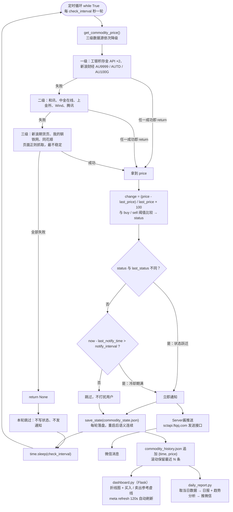

# 整体数据流

> **学习目标**：能够解释「整体数据流」的机制或步骤，并用本节材料验证理解。
>
> **前置知识**：Python `requests` 会话与超时、Web API 返回格式的解析技巧、简单的状态机与去重通知思想、Flask 路由与模板、`json` 文件持久化。
>
> **所属主题**：项目实战笔记 04：大宗商品价格监控 Agent · 技术架构

## 本次只学这一点

这张图回答的是"一轮监控到底做了什么、失败时又怎么退"，也就是 `main_monitor.py` 的主循环：

**读图要点**：

| 观察 | 含义 |
| --- | --- |
| 抓价的三级降级是一条独立的支线 | 抓价失败不会污染主循环：`return None` 后本轮直接跳过，既不写状态也不发通知 |
| 判断节点是 `DEC` 和 `COOL` 两级串联 | 这就是"状态变化 + 冷却期"的双条件通知，缺任何一个都会变成漏报或刷屏 |
| 落盘 `SAVE` 在通知之后，且两条分支都会走到 | 通知成功与否不影响状态更新；而 `last_notify_time` 只在发送成功后才写，保证失败可重试 |
| `SLEEP` 回连到 `LOOP` | 这是常驻模式的形状；`main_monitor.py` 不带参数时只跑一次就退出，由 cron 之类的外部调度器驱动 |
| 推送与留痕是两个并列出口 | "提醒"和"留痕"共用同一份判断结果，所以看板上的历史与用户收到的消息始终对得上 |

## 验证理解

- 合上正文，用自己的话解释本知识点解决的问题及适用边界。
- 若本节含代码、公式或流程，先预测结果，再运行、推导或逐步追踪；项目片段需要沿用原文的依赖与数据。
- 如果缺少变量、术语或完整代码，请查阅[综合原文](../../../../../08-project/04-Agent系统/04-项目-大宗商品价格监控Agent.md)；代码片段不等同于独立可运行项目。

## 自测与关联复习

- 「整体数据流」为什么需要这种设计？改变一个条件会怎样？
- 找出仍讲不清楚的地方，加入待复习并留下具体问题。
- [本主题目录](../index.md) · [完整示例、常见坑与原文自测](../../../../../08-project/04-Agent系统/04-项目-大宗商品价格监控Agent.md)
