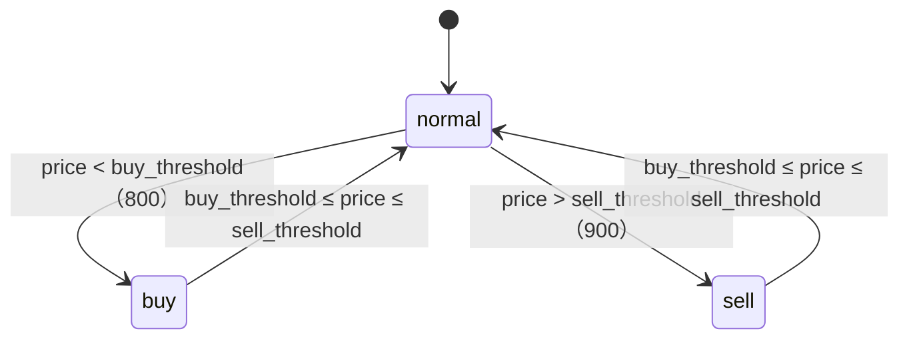

# 状态机

> **学习目标**：能够解释「状态机」的机制或步骤，并用本节材料验证理解。
>
> **前置知识**：Python `requests` 会话与超时、Web API 返回格式的解析技巧、简单的状态机与去重通知思想、Flask 路由与模板、`json` 文件持久化。
>
> **所属主题**：项目实战笔记 04：大宗商品价格监控 Agent · 技术架构

## 本次只学这一点

这张图回答的是"哪些价格变化会让状态发生跃迁"，把三种离散状态之间的转移画清楚：



**读图要点**：

| 观察 | 含义 |
| --- | --- |
| 只有三个状态，没有"中间价"状态 | 判断依据是价格落在哪个区间，而不是价格本身，所以 799 → 801 会触发跃迁、799 → 750 不会 |
| 只有 `normal` 是枢纽 | 从 `buy` 到 `sell` 不能一步直达，必须先回到 `normal`，价格不可能同时满足两个阈值 |
| 每条边都由**阈值比较**触发 | 状态定义写死在代码里、阈值写在配置里，改参考价不需要动状态机 |
| 状态跃迁只是"立即通知"的触发条件之一 | 状态长期不变时，冷却期满还会补发一次，两个条件合起来才是完整的通知规则 |

通知规则（这是全项目最核心的一段业务逻辑）：

```text
if status != state["last_status"]: # 状态跃迁 → 立刻通知
 通知
elif now - state["last_notify_time"] > notify_interval:
 通知（冷却期满，提醒"还在低位/高位"）
else:
 不通知（避免刷屏）
```

## 验证理解

- 合上正文，用自己的话解释本知识点解决的问题及适用边界。
- 若本节含代码、公式或流程，先预测结果，再运行、推导或逐步追踪；项目片段需要沿用原文的依赖与数据。
- 如果缺少变量、术语或完整代码，请查阅[综合原文](../../../../../08-project/04-Agent系统/04-项目-大宗商品价格监控Agent.md)；代码片段不等同于独立可运行项目。

## 自测与关联复习

- 「状态机」为什么需要这种设计？改变一个条件会怎样？
- 找出仍讲不清楚的地方，加入待复习并留下具体问题。
- [本主题目录](../index.md) · [完整示例、常见坑与原文自测](../../../../../08-project/04-Agent系统/04-项目-大宗商品价格监控Agent.md)
