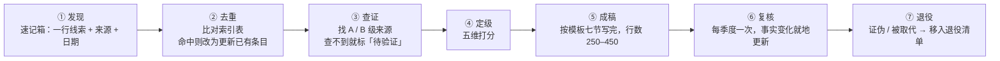

# 一条线索的完整生命周期

> **学习目标**：能够解释「一条线索的完整生命周期」的机制或步骤，并用本节材料验证理解。
>
> **前置知识**：先了解本主题的基本术语；示例环境与背景见综合原文。
>
> **所属主题**：这个栏目怎么用 · 一条线索的完整生命周期

## 本次只学这一点

这张图回答：一条线索从被看见到被淘汰，要依次做哪些动作，每个动作留下的产物是什么。

**读图要点**：

| 观察 | 含义 |
| --- | --- |
| 七个阶段是严格串行的 | 每一步的产物就是下一步的输入，跳步会直接导致条目无法复核 |
| ② 去重决定了后面是「新增」还是「更新」 | 同一个事实在索引表里只允许有一个落点，否则数字会分散在两条记录里 |
| ③ 查证是唯一的可能中止点 | 查不到 A / B 级来源不会让流程停下，但条目会被标为「待验证」，等级被限制 |
| ⑥ 复核是一条长周期回边 | 它不是流程的终点，而是让已发布的条目随事实变化就地处更新 |
| ⑦ 退役保留条目而不删除 | 退役清单让「这个说法后来被证伪」本身变成可查询的记录 |

| 阶段 | 产出 | 时间盒 | 完成标志 |
| --- | --- | --- | --- |
| ① 发现 | 速记一行 | 1 分钟 | 有来源链接和日期 |
| ② 去重 | 是 / 否 | 2 分钟 | 明确「新增」或「更新 XX 条目」 |
| ③ 查证 | 来源清单 | 20–40 分钟 | 至少 2 个 A 级或 1 个 A + 1 个 B 级来源 |
| ④ 定级 | 五维分数 + 综合等级 | 5 分钟 | 能回答「值不值得现在投入」 |
| ⑤ 成稿 | 条目文件 | 40–60 分钟 | 七节齐全，无占位符 |
| ⑥ 复核 | 更新记录 | 每季度 10 分钟 | 关键数字仍成立，或已修正 |
| ⑦ 退役 | 退役说明 | 触发时 10 分钟 | 索引表状态改为「已退役」 |

## 验证理解

- 合上正文，用自己的话解释本知识点解决的问题及适用边界。
- 若本节含代码、公式或流程，先预测结果，再运行、推导或逐步追踪；项目片段需要沿用原文的依赖与数据。
- 如果缺少变量、术语或完整代码，请查阅[综合原文](../../../../../10-radar/01-追踪方法/01-这个栏目怎么用.md)；代码片段不等同于独立可运行项目。

## 自测与关联复习

- 「一条线索的完整生命周期」为什么需要这种设计？改变一个条件会怎样？
- 找出仍讲不清楚的地方，加入待复习并留下具体问题。
- [本主题目录](../index.md) · [完整示例、常见坑与原文自测](../../../../../10-radar/01-追踪方法/01-这个栏目怎么用.md)
